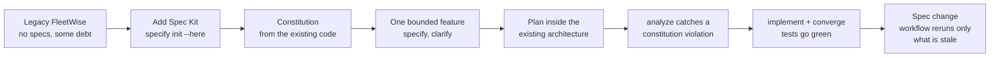
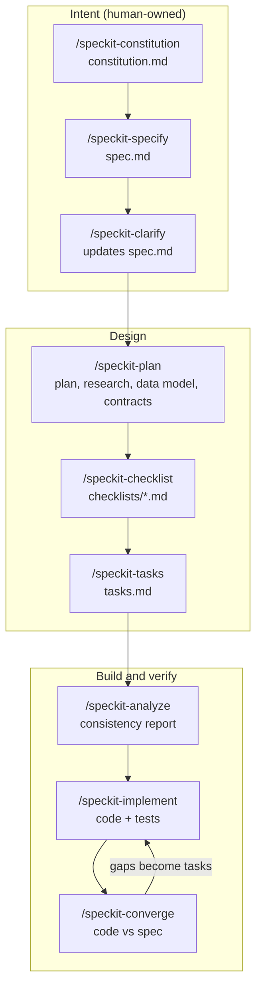
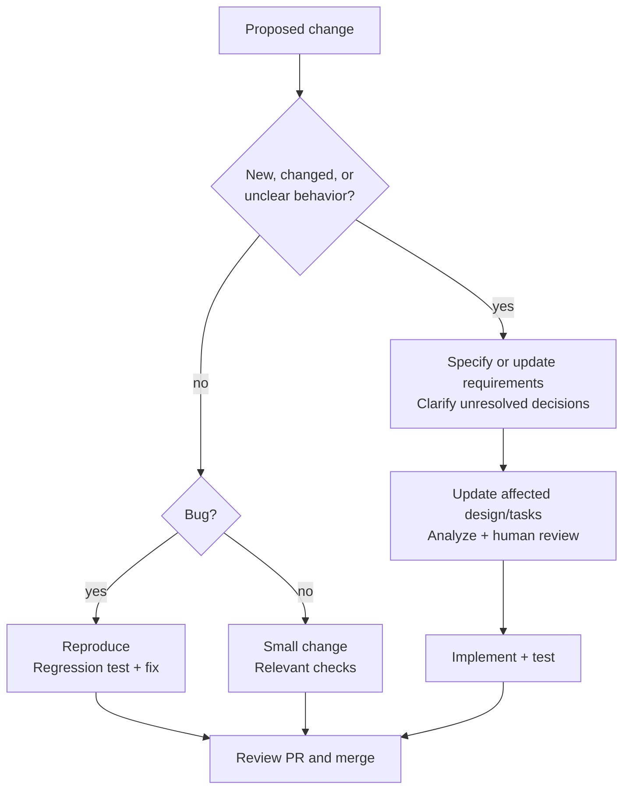
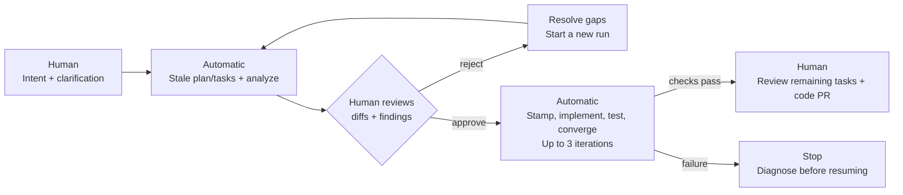
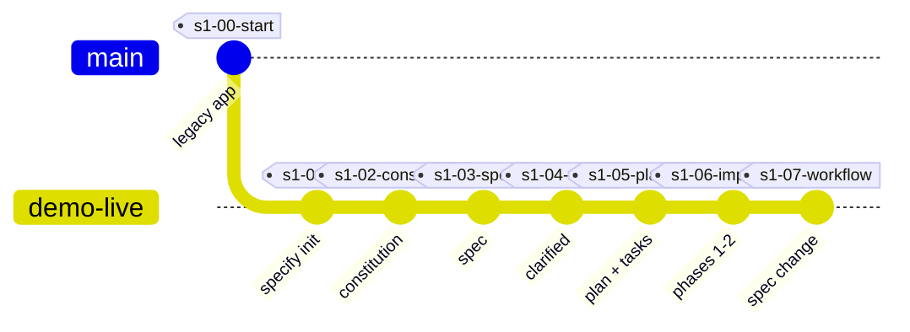

# Spec Kit on a Brownfield App: FleetWise

**Stop prompting, start specifying.** A hands-on, repeatable demo of spec-driven development (SDD) with [GitHub Spec Kit](https://github.com/github/spec-kit) and GitHub Copilot, applied to an existing ("brownfield") .NET application.

FleetWise is a fictional fleet-maintenance SaaS. It works, but like most real systems it has history: shortcuts, missing rules, and no specs. This repo shows how a team adopts Spec Kit on code like that, one bounded slice at a time, and then automates the flow with Spec Kit workflows.

[](https://github.com/hkaanturgut/spec-kit-fleetwise/actions/workflows/ci.yml)

Discussing team adoption? Start with the [practical Q&A](#qa-everyday-development).

## What you will see



## Quick start

Prerequisites: .NET 8 SDK **8.0.400 or later in the 8.0 line** (see `global.json`), Python 3.11+, [uv](https://docs.astral.sh/uv/), Git, VS Code with GitHub Copilot. Optional: [GitHub Copilot CLI](https://docs.github.com/copilot/how-tos/set-up/install-copilot-cli) (for workflow runs) and the GitHub CLI.

```bash
git clone https://github.com/hkaanturgut/spec-kit-fleetwise.git
cd spec-kit-fleetwise
scripts/install-tools.sh     # installs the pinned Spec Kit version (.speckit-version)
scripts/reset.sh             # branch demo-live at the starting checkpoint
git restore --source=main -- scripts/preflight.sh  # current check, without moving historical tags
scripts/preflight.sh         # green/red readiness check
dotnet run --project src/FleetWise.Api   # Swagger at http://localhost:5080/swagger
```

Then follow [docs/demo-guide.md](docs/demo-guide.md). Every prompt is copy-paste ready.

Check `dotnet --version` **inside this repository** before rehearsal. An older
8.0 SDK or a .NET 9 SDK installed elsewhere does not satisfy `global.json`.
If SDK resolution fails, check `which dotnet` and `dotnet --list-sdks`; select the
compatible installation on your PATH rather than weakening the repository pin.
`reset.sh` and `jump.sh` discard local files: save any work first.

## The spec-driven flow

Each step leaves a reviewable file. Humans own the intent; the AI does the translation; humans review at each gate.



## Q&A: everyday development

### Do we need Spec Kit for every change, including small ones?

**No. Match the process to uncertainty and risk, not the size of the diff.**
Typos, formatting, and straightforward fixes can use a normal PR with relevant
checks. New behavior or unclear requirements benefit from specification.
A two-line authorization change can still need careful design review and tests.



This is a recommended team process, not a rule enforced by Spec Kit. Even
[Spec Kit's contribution guidance](https://github.com/github/spec-kit/blob/main/CONTRIBUTING.md)
allows small fixes through the normal issue, PR, review, and test process.

### How do we fix a bug without starting the whole lifecycle again?

**If the agreed behavior is clear, fix the implementation.** Reference the
requirement, add a failing regression test, fix the root cause, and review the PR.
Update the spec only if the intended behavior is missing, ambiguous, or changing.

FleetWise example: **T026** records that an unknown tenant gets `200` with an
empty list, although the dispatcher API contract requires `400`.

- Add a test expecting `400` for an unknown tenant.
- Fix tenant validation and run the relevant tests plus the existing suite.
- Close the task with the reviewed fix. No new constitution or feature spec is needed.

The bug is deliberately still present at `s1-06-implement` for this teaching moment.

### How do multiple team members work on the same project?

**Share the specification, divide the work, and review through PRs.**

| Responsibility | Owner |
| --- | --- |
| Intent and acceptance criteria | Product owner and developers |
| Design and constitution compliance | Technical lead |
| Bounded implementation tasks | Developers and coding agents |
| Integration and task-list reconciliation | Named feature owner |
| Shared tooling and workflow defaults | Platform or DevEx team |

For feature work, use one feature folder and an integration branch, with separate
task branches/worktrees for parallel contributors. Assign only truly independent
`[P]` tasks in parallel; shared files and dependencies still need coordination.
Avoid multiple agents rewriting the same `tasks.md` simultaneously.

Timestamp-based feature naming reduces numbering collisions. Each worktree must
select the right feature through `.specify/feature.json` or
`SPECIFY_FEATURE_DIRECTORY`. Separate spec folders do not eliminate conflicts
in shared application code.

Use CODEOWNERS and branch protection to enforce review. Spec Kit does not enforce
team ownership itself. See the [team playbook](docs/team-playbook.md) for the
three gates: intent, design, and implementation.

### What are the most useful adoption practices?

- **Specify the change, not the entire legacy system.** Start with one bounded slice.
- **Keep the constitution small and deliberate.** Change team rules through review, not for every ticket.
- **Review actual artifacts.** An AI saying "done" or exiting successfully is not proof of correctness.
- **Keep spec and code consistent.** Update affected artifacts when requirements change; preserve completed task history.
- **Use tests as evidence.** Analyze checks artifact consistency; it does not replace execution or code review.
- **Pin tooling and keep recovery points.** Use small PRs and known-good checkpoints, not an unlimited autonomous run.

### How do we use Spec Kit workflows?

Workflows chain commands, conditions, shell checks, and review gates. This repo's
`sdd-autopilot` uses Spec Kit's built-in workflow engine with a repository-specific
definition. It checks state, skips current stages, and reconciles stale plan/tasks.

Use an initialized feature on an isolated worktree or feature branch, with
clarification questions resolved. Use the current workflow from `main`; see the
[demo guide](docs/demo-guide.md#workflow-automation-37-42) when starting from a historical tag.

```bash
specify workflow add --dev ./workflows/sdd-autopilot
specify workflow run sdd-autopilot -i until=converge < /dev/null
```

The non-interactive run pauses at the plan-review gate. Review the generated
diffs and analyze report, then approve:

```bash
specify workflow status
specify workflow resume <run_id> -i approval=approve < /dev/null
```

Use `until=analyze` instead when you only want design review, not implementation.
Use `approval=reject` when the artifacts are not ready. Input fingerprints are
stamped only after approval.

### Can it run automatically without someone watching every step?

**Yes between decision points, not without accountability.**



The PR review in this diagram is a team responsibility, not an automatic PR-opening
step in the current workflow.

| Available in this repo | Not implemented here yet |
| --- | --- |
| State-aware execution and resumable review gates | Scheduled or issue-triggered real Copilot runs in GitHub Actions |
| Bounded implement/test/converge loop | Automatic repair after a failing test command |
| CI builds, tests, and offline workflow checks | Automatic task assignment, PR creation, and failure notifications |

**Today a failing `dotnet test` stops the run.** The loop can repeat when tests
pass and tasks remain, up to three iterations. Reaching that limit does not prove
all work is complete. CI uses a stub Copilot for workflow checks, not a live coding agent.

For unattended execution, use an isolated runner with narrowly scoped credentials,
time/cost limits, preserved logs, and escalation on ambiguity or failure. Keep
human merge approval initially. Do not pre-approve unseen plans just to remove
the pauses.

The current Copilot integration enables broad tool permissions by default
(`--yolo`, controlled by `SPECKIT_COPILOT_ALLOW_ALL_TOOLS`).
**A feature branch is not a security sandbox.** Review the
[workflow automation guide](docs/workflow-automation.md) before running it unattended.

## Checkpoints

Every demo step ends on a git tag, so a slow or surprising AI step never derails a live session: `scripts/jump.sh <tag>` restores a known-good state recorded from a real dry run.



> The checkpoints were recorded in a full dry run with Spec Kit v1.0.13. Expected AI outputs for each step are in [demo/reference-outputs.md](demo/reference-outputs.md).

## Repository map

| Path | What it is |
| --- | --- |
| `src/FleetWise.Api` | The legacy .NET 8 Web API (EF Core + SQLite, Swagger) |
| `tests/FleetWise.Tests` | xUnit tests, including characterization tests of legacy behavior |
| `workflows/sdd-autopilot` | Spec Kit workflow: runs only the stale SDD steps, with human gates |
| `scripts/` | `install-tools`, `preflight`, `reset`, `jump`, and the `speckit_state.py` state checker |
| `tests/workflow` | Offline scenario tests for the workflow, using a stub Copilot CLI |
| `docs/` | Architecture, demo guide, team playbook, workflow automation |
| `demo/` | Feature cards and backup notes for live sessions |

## Documentation

- [Architecture and known debt](docs/architecture.md)
- [Demo guide: every command and prompt](docs/demo-guide.md)
- [Team playbook: Spec Kit with many developers](docs/team-playbook.md)
- [Workflow automation: the sdd-autopilot workflow](docs/workflow-automation.md)

## License

[MIT](LICENSE)
