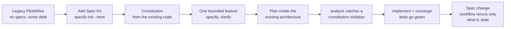
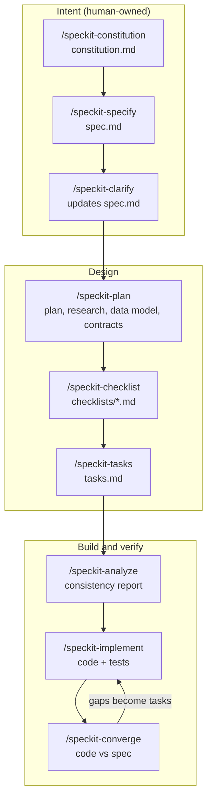
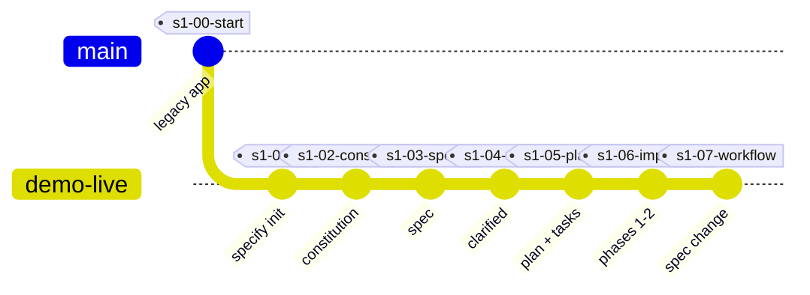

# Spec Kit on a Brownfield App: FleetWise

**Stop prompting, start specifying.** A hands-on, repeatable demo of spec-driven development (SDD) with [GitHub Spec Kit](https://github.com/github/spec-kit) and GitHub Copilot, applied to an existing ("brownfield") .NET application.

FleetWise is a fictional fleet-maintenance SaaS. It works, but like most real systems it has history: shortcuts, missing rules, and no specs. This repo shows how a team adopts Spec Kit on code like that, one bounded slice at a time, and then automates the flow with Spec Kit workflows.

[](https://github.com/hkaanturgut/spec-kit-fleetwise/actions/workflows/ci.yml)

## What you will see



## Quick start

Prerequisites: .NET 8 SDK, Python 3.11+, [uv](https://docs.astral.sh/uv/), Git, VS Code with GitHub Copilot. Optional: [GitHub Copilot CLI](https://docs.github.com/copilot/how-tos/set-up/install-copilot-cli) (for workflow runs) and the GitHub CLI.

```bash
git clone https://github.com/hkaanturgut/spec-kit-fleetwise.git
cd spec-kit-fleetwise
scripts/install-tools.sh     # installs the pinned Spec Kit version (.speckit-version)
scripts/reset.sh             # branch demo-live at the starting checkpoint
scripts/preflight.sh         # green/red readiness check
dotnet run --project src/FleetWise.Api   # Swagger at http://localhost:5080/swagger
```

Then follow [docs/demo-guide.md](docs/demo-guide.md). Every prompt is copy-paste ready.

## The spec-driven flow

Each step leaves a reviewable file. Humans own the intent; the AI does the translation; humans review at each gate.



## Checkpoints

Every demo step ends on a git tag, so a slow or surprising AI step never derails a live session: `scripts/jump.sh <tag>` restores a known-good state recorded from a real dry run.



> The checkpoints were recorded in a full dry run with Spec Kit v1.0.13. Expected AI outputs for each step are in [demo/reference-outputs.md](demo/reference-outputs.md).

## Repository map

| Path | What it is |
| --- | --- |
| `src/FleetWise.Api` | The legacy .NET 8 Web API (EF Core + SQLite, Swagger) |
| `tests/FleetWise.Tests` | xUnit tests, including characterization tests of legacy behavior |
| `workflows/sdd-autopilot` | Spec Kit workflow: runs only the stale SDD steps, with human gates |
| `scripts/` | `install-tools`, `preflight`, `reset`, `jump`, and the `speckit_state.py` state checker |
| `tests/workflow` | Offline scenario tests for the workflow, using a stub Copilot CLI |
| `docs/` | Architecture, demo guide, team playbook, workflow automation |
| `demo/` | Feature cards and backup notes for live sessions |

## Documentation

- [Architecture and known debt](docs/architecture.md)
- [Demo guide: every command and prompt](docs/demo-guide.md)
- [Team playbook: Spec Kit with many developers](docs/team-playbook.md)
- [Workflow automation: the sdd-autopilot workflow](docs/workflow-automation.md)

## License

[MIT](LICENSE)
