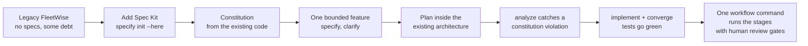
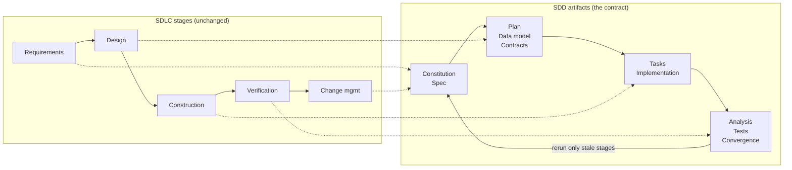
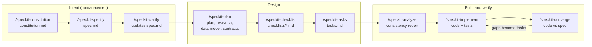
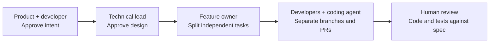
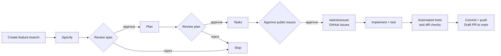
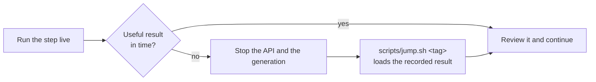
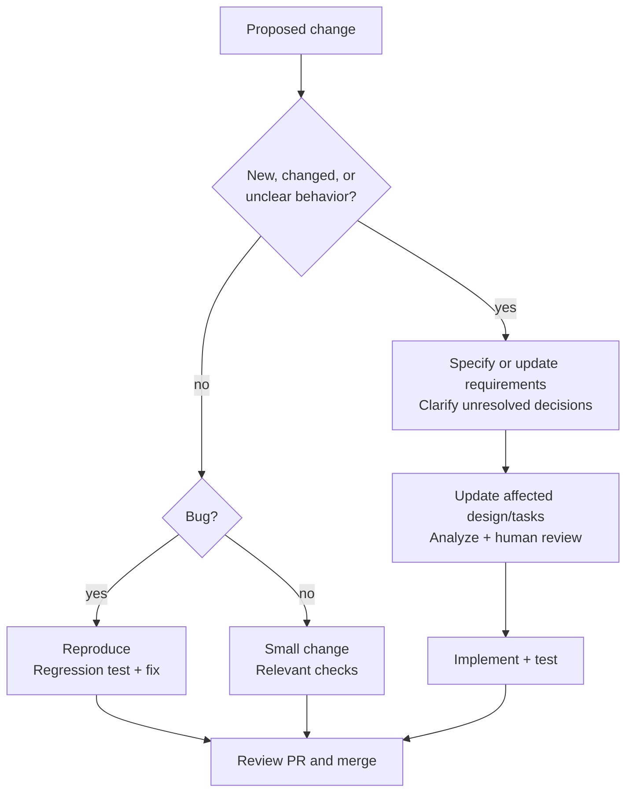
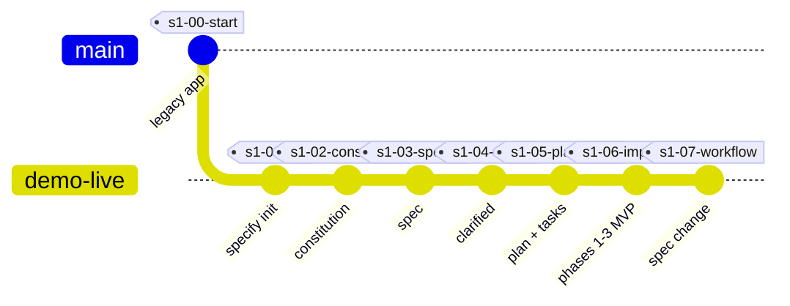

# Spec Kit on a Brownfield App: FleetWise

**Stop prompting, start specifying.** A hands-on, repeatable demo of spec-driven development (SDD) with [GitHub Spec Kit](https://github.com/github/spec-kit) and GitHub Copilot, applied to an existing ("brownfield") .NET application.

FleetWise is a fictional fleet-maintenance SaaS. It works, but like most real systems it has history: shortcuts, missing rules, and no specs. This repo shows how a team adopts Spec Kit on code like that, one bounded slice at a time, and then automates the flow with Spec Kit workflows.

[](https://github.com/hkaanturgut/spec-kit-fleetwise/actions/workflows/ci.yml)

**Start here:** [Quick start](#quick-start) — run FleetWise in about five minutes.<br>
**Understand it:** [The ideas](#the-ideas-behind-this-demo) · [The spec-driven flow](#the-spec-driven-flow)<br>
**Do it:** [Walkthrough](#walkthrough-adopt-spec-kit-on-this-repo) · [Steps 1-7](#step-1-add-spec-kit) · [Team](#working-as-a-team) · [Automation](#automate-the-flow-with-a-workflow)<br>
**Everyday use:** [Q&A](#qa-everyday-development) · [If a step goes wrong](#if-a-step-goes-wrong)

## What you will build



## Quick start

Prerequisites: .NET 8 SDK **8.0.400 or later in the 8.0 line** (see `global.json`), Python 3.11+, [uv](https://docs.astral.sh/uv/), Git, VS Code with GitHub Copilot. The workflow automation step also needs [GitHub Copilot CLI](https://docs.github.com/copilot/how-tos/set-up/install-copilot-cli). The API examples use `curl` and `jq`; the team step uses the GitHub CLI.

```bash
git clone https://github.com/hkaanturgut/spec-kit-fleetwise.git
cd spec-kit-fleetwise
scripts/install-tools.sh     # installs the pinned Spec Kit version (.speckit-version)
scripts/reset.sh             # branch demo-live at the starting checkpoint
scripts/preflight.sh         # green/red readiness check
dotnet run --project src/FleetWise.Api --urls http://localhost:5081
```

Swagger is at `http://localhost:5081/swagger`; try `GET /api/reports/overdue` to
see the legacy behavior you are about to replace. Port 5081 leaves any prepared
reference instance on 5080 alone.

**Next:** stop the API with **Ctrl+C**, then either read
[the ideas behind this demo](#the-ideas-behind-this-demo) or go straight to the
[walkthrough](#walkthrough-adopt-spec-kit-on-this-repo) and adopt Spec Kit yourself.

> [!WARNING]
> `scripts/reset.sh` and `scripts/jump.sh` discard local files. Save any work first,
> and prefer a dedicated practice clone.

**If the SDK check fails:** run `dotnet --version` **inside this repository**. An
older 8.0 SDK, or a .NET 9 SDK installed elsewhere, does not satisfy `global.json`.
Check `which dotnet` and `dotnet --list-sdks` and select a compatible installation
on your PATH rather than weakening the repository pin.

## The ideas behind this demo

### What is spec-driven development?

Spec-driven development (SDD) builds software from an explicit, reviewable
description of intended behavior. The specification is a living contract, not a
one-time document: when intent changes, design, tasks, tests, and code are
updated with it.

| | 🎲 Prompt-driven | 📐 Spec-driven |
| --- | --- | --- |
| **Source of truth** | The last chat message | A versioned spec in the repo |
| **Where intent lives** | In someone's head | In a reviewed artifact |
| **Review target** | Generated code | Intent, constraints, then code |
| **Ambiguity** | Silently invented by the agent | Raised as an explicit decision |
| **Repeatability** | Reroll the prompt, get new behavior | Rerun the stage, get the same contract |
| **Traceability** | Commit messages, maybe | Requirement → plan → task → test → code |
| **Onboarding** | Read the diff and guess | Read the spec |

> [!NOTE]
> SDD is **not** "write a giant document before any code". It is "make the next
> meaningful change understandable and testable". In a brownfield system: take
> one bounded slice, inspect existing conventions, record the decisions that
> matter, leave the rest of the legacy system alone.

### SDLC vs. AI-DLC

Three different layers, often confused. They stack rather than compete:

| Layer | Scope | Answers | Artifact in this repo |
| --- | --- | --- | --- |
| **SDLC** | Lifecycle map | *Which stages* does the work pass through? | Discover → design → build → test → release → learn |
| **AI-DLC** | Operating model | *How do those stages behave* when AI generates at speed? | Small increments, explicit gates, traceability |
| **SDD** | Practice | *What mechanism* keeps intent authoritative? | Constitution, spec, plan, tasks |
| **Spec Kit** | Tooling | *Which commands* execute the practice? | `/speckit.*` commands + workflows |

What actually changes when AI enters the loop:

| Dimension | 🧑‍💻 Classic SDLC | 🤖 AI-DLC |
| --- | --- | --- |
| **Bottleneck** | Producing artifacts | Establishing intent, supplying context, checking correctness |
| **Cost of code** | High — hours per change | Near zero — seconds per change |
| **Scarce resource** | Engineering time | Reviewed intent and trustworthy context |
| **Batch size** | Sprint or release | One reviewable increment |
| **Role of docs** | Trailing byproduct, often stale | Leading contract, kept current |
| **Human role** | Author of the code | Approver of intent, trade-offs, and risk |
| **Dominant risk** | Slow delivery | Fast propagation of a plausible wrong assumption |
| **Verification** | Test after build | Continuous checks on artifacts *and* behavior |

SDD is the bridge: it gives AI-DLC a stable source of truth while preserving the
familiar SDLC stages.



| SDLC concern | AI-DLC practice | Spec Kit evidence |
| --- | --- | --- |
| Requirements | Make intent and constraints explicit | Constitution, spec, clarification decisions |
| Design | Ask AI to work inside the existing architecture | Plan, data model, contracts, tasks |
| Construction | Generate bounded changes from approved tasks | Implementation, tests, code review |
| Verification | Check artifacts and behavior continuously | Analysis findings, test results, convergence report |
| Change management | Revisit only the stages affected by a requirement change | Updated artifacts and workflow state |

### Why practice SDD in the AI era?

AI makes implementation cheaper. It does not make ambiguous requirements safe.
Without a shared specification, an agent produces a polished answer that
silently invents a threshold, omits tenant isolation, or changes an API
contract — and faster generation spreads that assumption faster.

| ⚠️ Failure without a spec | ✅ What SDD adds | 🔍 Where you see it |
| --- | --- | --- |
| Agent invents a threshold or default | Humans own intent, trade-offs, acceptance | Spec acceptance criteria |
| Agent lacks the constraint it needed | Context and rules given up front | Constitution, plan |
| Decision buried in a 900-line diff | Decisions reviewed before code | Clarification log |
| "Why does this endpoint behave this way?" | Requirement traced to design, task, test, behavior | Task IDs linked to spec sections |
| Plausible but wrong change ships | Recovery by reverting the artifact, not archaeology | Versioned specs + workflow state |
| Automation approves its own unknowns | Repeatable work automated, approval is not | Human gates in the workflow |

> [!TIP]
> The goal is not more paperwork. The goal is to move important reasoning into a
> small, shared artifact that both people and AI can inspect.

### What is GitHub Spec Kit?

[GitHub Spec Kit](https://github.com/github/spec-kit) is an open-source toolkit
for practicing SDD with an AI coding agent. It provides reusable commands,
templates, and workflow support for turning intent into a constitution,
specification, clarification decisions, technical plan, tasks, implementation,
and verification.

Spec Kit is a delivery process, not a replacement application architecture or a
promise that AI-generated code is correct. Teams still choose the requirements,
review the design, run the tests, and approve the change. In this repository,
Spec Kit is applied to an existing .NET API: the team first captures current
conventions, then adds one tenant-scoped overdue-dispatcher slice without
rewriting FleetWise.

The central loop is:

```text
intent -> specify -> clarify -> plan -> tasks -> analyze -> implement -> converge
```

Each step leaves evidence that can be reviewed or rerun. That is what makes the
approach useful for both a human team and an AI-assisted workflow.

## The spec-driven flow

Each step leaves a reviewable file. Humans own the intent; the AI does the translation; humans review at each gate.



## Walkthrough: adopt Spec Kit on this repo

Follow this end to end and you will have adopted Spec Kit on a real codebase:
captured its conventions, specified one feature, caught a design violation before
writing code, implemented a tenant-scoped slice, and automated the flow.

**The scenario:** FleetWise's overdue report uses a hard-coded mileage rule
("10,000 km since any service") and returns vehicles from *all* customers. You will
specify one replacement: an overdue-maintenance dispatcher with technician
suggestions and manager approval, then build **only User Story 1, the
tenant-scoped overdue list**. Suggestions and approval stay planned work — that is
the point of bounded slices.

| Step | What you do | What you learn |
| --- | --- | --- |
| [0](#step-0-see-what-prompt-only-coding-produces) | Ask Copilot for the feature with no spec | A plausible answer can hide business assumptions |
| [1](#step-1-add-spec-kit) | `specify init --here` | Adding a process, not a new architecture |
| [2](#step-2-derive-the-constitution-from-existing-code) | Read the code, then write the constitution | Existing code is evidence, not automatically policy |
| [3](#step-3-specify-one-bounded-slice) | `/speckit-specify` | Specify the change, not the whole legacy system |
| [4](#step-4-clarify-business-decisions) | `/speckit-clarify` | People decide policy; agents do not invent it |
| [5](#step-5-plan-within-the-existing-architecture) | `/speckit-plan`, `/speckit-tasks` | Design is reviewed before any code is written |
| [6](#step-6-let-analyze-catch-the-gap) | `/speckit-analyze` | A contradiction is cheapest to fix in the design |
| [7](#step-7-implement-and-converge) | `/speckit-implement`, `/speckit-converge` | Passing tests ≠ requirement coverage |
| [Team](#working-as-a-team) | Split tasks, review PRs | The spec is a contract between people |
| [Automate](#automate-the-flow-with-a-workflow) | `specify workflow run` | Automate execution, keep human gates |

**The brownfield playbook**, in one table:

| Do | Don't |
| --- | --- |
| Inspect existing conventions first | Assume the agent knows your architecture |
| Agree on the rules that matter, in writing | Write a 40-principle constitution nobody reads |
| Pick one bounded slice | Try to specify the whole legacy system first |
| Implement inside the existing architecture | Let the agent introduce new projects or frameworks |
| Record known violations as debt | Promote an accidental pattern to policy |

### Before you start: set up your environment

Finish the [Quick start](#quick-start) first, then arrange **one VS Code window**:

| What | Where | Used for |
| --- | --- | --- |
| This `README.md` | Markdown preview, pinned to the side | The steps you are following |
| **Copilot Chat, agent mode** | Side panel | Every `text` block below |
| **Terminal A** | Integrated terminal | Every `bash` block |
| **Terminal B** | Second integrated terminal | Running the API |

> [!WARNING]
> `scripts/reset.sh` and `scripts/jump.sh` **discard uncommitted work and local
> files**. Use a dedicated practice clone, and stop Terminal B's API before running
> either one.

**Terminal A, confirm you are ready:**

```bash
git status --short
scripts/reset.sh
scripts/preflight.sh
scripts/jump.sh --list
```

**Expected:** preflight GREEN, 15 baseline tests, eight checkpoint tags.

`reset.sh` and `jump.sh` restore the current README, the reset/jump/preflight
scripts, and the workflow definition from your local `main` after each checkout;
application code and specs come from the tag. So tooling differences showing up in
`git status` are intentional. Historical tags are never moved.

Start from an up-to-date `main`. If you checked out an old tag manually and are
running its old helper scripts, bootstrap them once:

```bash
git restore --source=main -- README.md scripts/jump.sh scripts/reset.sh scripts/preflight.sh workflows/sdd-autopilot/workflow.yml
```

**Every step has an escape hatch.** If a live agent run is slow or goes sideways,
run that step's `scripts/jump.sh <tag>` command to load the recorded result and
continue. See [if a step goes wrong](#if-a-step-goes-wrong).

### Step 0: see what prompt-only coding produces

Start with the failure mode, so the rest has a reason to exist.

**Copilot Chat:**

```text
Add an endpoint that lists overdue vehicles and suggests a work order for each.
```

**Look for** one real assumption in the answer: an invented mileage or day
threshold, no tenant scoping, or a technician chosen by a rule nobody agreed on.
Read what it actually produced — do not assume a specific flaw. Stop a slow
generation instead of waiting it out.

**Why this matters:** nothing in the prompt said *overdue by what rule*, or *whose
vehicles*. The agent still had to answer both, so it guessed — silently, in code.

**Terminal A, discard this and return to the baseline:**

```bash
scripts/jump.sh s1-00-start
```

If the answer happens to be reasonable, the baseline itself makes the point: the
legacy rule is "10,000 km since any service" and it has no tenant isolation. That
is recorded behavior in this repo, not a claim about what Copilot just generated.

### Step 1: add Spec Kit

**Terminal A:**

```bash
git switch -c "adopt-spec-kit-$(date +%Y%m%d-%H%M%S)"
```

> [!NOTE]
> **What:** `specify init` installs Spec Kit's project files and Copilot skills in this repository.<br>
> **When:** Once when adopting Spec Kit, before writing the constitution or a feature spec.<br>
> **Why:** Give the agent a repeatable process without replacing the existing application. `--force` permits setup in a non-empty directory; review the resulting changes.

```bash
specify init --here --force --integration copilot
git status --short
```

**Expected:** `.specify/` and `.github/skills/` contain the generated process
files; application code is unchanged. You added the delivery process, not a new
application architecture. Skills are hyphenated: `/speckit-plan`, not `/speckit.plan`.

**Recorded result:**

```bash
scripts/jump.sh s1-01-init
```

### Step 2: derive the constitution from existing code

Ask the agent to **read first and change nothing.** You cannot agree on rules you
have not looked at.

**Copilot Chat, discovery only:**

```text
Read this repository and list the engineering conventions it already follows: layering, data access, validation, error handling, testing, naming, configuration, and multi-tenancy. For each convention, cite one or two files as evidence. Then list every place that breaks the convention. Do not change any files.
```

**Expected evidence:**

| Convention | Followed by | Broken by |
| --- | --- | --- |
| Data access through a service layer | `VehiclesController`, `WorkOrdersController` | `TechniciansController`, `ReportsController` use `DbContext` directly |
| Tenant isolation | `TenantId` exists in the data model | Legacy queries never filter by it |

**The judgment call:** existing code is evidence, not automatically policy. Keep
the service layer (most of the code already follows it), record the two violations
as known debt, and add tenant isolation as a rule the team agrees on *now* — the
codebase does not have it yet.

**Copilot Chat:**

> [!NOTE]
> **What:** `/speckit-constitution` records the team's agreed engineering principles.<br>
> **When:** At adoption, or when the team deliberately changes its rules, not for every ticket.<br>
> **Why:** Make constraints such as tenant isolation explicit so later design and implementation can be reviewed against them.

```text
/speckit-constitution Capture only principles that are true in this codebase today or that the team agreed now:
1. Data access goes through the service layer; controllers never use DbContext directly. The two existing violations are known debt, not allowed patterns.
2. Tenant isolation is mandatory: every query and command is scoped by TenantId. This is a new rule agreed today.
3. Tests first: new behavior starts with failing xUnit tests.
4. The public REST API stays backward compatible; changes are additive.
5. No secrets in code; configuration comes from environment variables or appsettings.
```

**Read `.specify/memory/constitution.md`** and review the diff before committing.

```bash
git --no-pager diff --stat
git add -A
git commit -m "docs: adopt Spec Kit constitution"
```

**Recorded result:**

```bash
scripts/jump.sh s1-02-constitution
```

### Step 3: specify one bounded slice

**Copilot Chat:**

> [!NOTE]
> **What:** `/speckit-specify` turns a feature request into user stories, requirements, and acceptance criteria.<br>
> **When:** Starting a bounded feature or behavior change that needs an explicit agreement.<br>
> **Why:** Define what success means before the agent chooses how to implement it. A straightforward bug with clear expected behavior does not need a new feature spec.

```text
/speckit-specify Fleet managers need an overdue-maintenance dispatcher. Show vehicles that are overdue or due within 7 days, by mileage or by date. Suggest a work order for each vehicle with the right service type and a technician who has the required skill. A manager must approve a work order before it is booked.
```

If `specify` asks its own questions, reply:

```text
Keep them as open questions in the spec; we will run clarify next.
```

**Read `specs/<feature>/spec.md`:** user stories, acceptance criteria,
requirements, and `[NEEDS CLARIFICATION]` markers. Note what it *did not* decide —
those markers are the next step's input. A live run may pick a different folder
name; the checkpoints use `specs/001-overdue-dispatcher/`.

**Recorded result:**

```bash
scripts/jump.sh s1-03-specify
```

### Step 4: clarify business decisions

**Copilot Chat:**

> [!NOTE]
> **What:** `/speckit-clarify` asks targeted questions and integrates the answers into the spec.<br>
> **When:** Requirements contain ambiguities or unresolved business decisions, ideally before planning.<br>
> **Why:** Have people decide policy rather than letting implementation silently invent it.

```text
/speckit-clarify
```

**Answer with the decisions a business would actually make:**

| Question | Decision |
| --- | --- |
| No qualified technician available? | Suggest unassigned, flag "no qualified technician," never use another customer's technician |
| Who can approve a work order? | Only a FleetManager in the same customer |
| Several qualified technicians? | Fewest scheduled work orders in the next 7 days; ties alphabetically |

**Check the spec:** each decision is integrated and the unresolved markers are
gone. These are exactly the answers Step 0's agent invented on its own.

**Recorded result:**

```bash
scripts/jump.sh s1-04-clarify
```

### Step 5: plan within the existing architecture

Run these **one at a time**, reviewing between them.

**Copilot Chat:**

> [!NOTE]
> **What:** `/speckit-plan` translates the spec into a technical plan and supporting design artifacts.<br>
> **When:** Behavior is understood, before generating implementation tasks; revisit it when requirements or design constraints change.<br>
> **Why:** Check architecture, data contracts, and constitution compliance before investing in code.

```text
/speckit-plan Extend the existing .NET 8 Web API and EF Core model. Reuse VehicleService and WorkOrderService, add a DispatcherService in the existing service layer, and expose endpoints under /api/dispatch. Use the existing SQLite setup locally. No new projects and no new frameworks.
```

> [!NOTE]
> **What:** `/speckit-tasks` converts the spec and design into an ordered implementation checklist.<br>
> **When:** The plan is ready for review, or design changes require the task list to be reconciled.<br>
> **Why:** Make dependencies, test work, and potential parallel tasks visible instead of asking the agent to build everything at once.

```text
/speckit-tasks
```

**Read `plan.md`, `data-model.md`, `contracts/`, and `tasks.md`.** The constraints
in the prompt ("no new projects and no new frameworks") are what keep an agent from
redesigning your application while implementing a feature.

**Now load the prepared fault, so the next step has something to catch:**

```bash
scripts/jump.sh s1-05-plan-tasks
```

This checkpoint deliberately contains a bad technician lookup:
`TechnicianMatcher.SuggestAsync(serviceType, requiredSkill)` is **not
tenant-scoped**, while the plan's own Constitution Check says PASS. This tests
whether analysis catches a violation — not every live plan makes this mistake.

### Step 6: let analyze catch the gap

**Copilot Chat:**

> [!NOTE]
> **What:** `/speckit-analyze` checks the spec, plan, and tasks for inconsistencies, coverage gaps, and constitution violations without fixing them.<br>
> **When:** All three artifacts exist, before implementation and after significant artifact changes.<br>
> **Why:** Find contradictions cheaply while they are still in the design. This is not a substitute for tests or human review.

```text
/speckit-analyze
```

**Expected findings:**

| Finding | Severity | Why it matters |
| --- | --- | --- |
| Technician lookup lacks TenantId; plan incorrectly says PASS | CRITICAL | Violates the tenant-isolation principle |
| No test proves another tenant's technician is excluded | HIGH | The safety requirement is not covered |

**Fix the source, not the symptom.** The temptation is to patch `tasks.md` and move
on; then the design still says the wrong thing and the next regeneration brings the
bug back.

```text
Fix this at the source: update plan.md and data-model.md so every dispatcher query and command is scoped by TenantId. Do not edit tasks.md by hand.
```

> [!NOTE]
> **What:** Rerun `/speckit-tasks` to reconcile the checklist with the corrected tenant-scoped design.<br>
> **When:** After fixing the source artifacts identified by analysis.<br>
> **Why:** Carry the design correction into implementation and test tasks, rather than leaving a stale checklist.

```text
/speckit-tasks
```

> [!NOTE]
> **What:** Rerun `/speckit-analyze` against the updated artifacts.<br>
> **When:** After regenerating tasks and before moving into implementation.<br>
> **Why:** Verify that the original finding is resolved and the correction did not introduce another inconsistency.

```text
/speckit-analyze
```

**Expected:** the critical tenant-scope finding is resolved. Other findings still
need your review — a PASS label alone is not evidence.

**See the recorded correction instead:**

```bash
git --no-pager diff s1-05-plan-tasks s1-06-implement -- specs/001-overdue-dispatcher/plan.md specs/001-overdue-dispatcher/data-model.md specs/001-overdue-dispatcher/tasks.md
```

The fault is recorded at `s1-05-plan-tasks`; the corrected design and the built MVP
are both in `s1-06-implement`. There is no separate post-analysis tag.

### Step 7: implement and converge

**Copilot Chat:**

> [!NOTE]
> **What:** `/speckit-implement` executes the planned tasks, modifying code and tests.<br>
> **When:** The design is reviewed and critical analysis findings are resolved.<br>
> **Why:** Build against explicit scope and dependencies. The phase limit here keeps the build to User Story 1 instead of the whole feature.

```text
/speckit-implement Phases 1 to 3 only (User Story 1, the MVP)
```

**Terminal A:**

```bash
dotnet test --nologo
```

**Copilot Chat:**

> [!NOTE]
> **What:** `/speckit-converge` compares the implementation with the feature artifacts and records remaining gaps as tasks.<br>
> **When:** After an implementation slice and its tests, or when checking whether code has caught up with the spec.<br>
> **Why:** Passing tests alone do not prove requirement coverage. Convergence exposes unfinished behavior without pretending the feature is complete.

```text
/speckit-converge
```

**Expected at the checkpoint:**

| Signal | Value |
| --- | --- |
| Tests | 24 passing, up from 15 |
| Gap recorded as T026 | Unknown tenant returns `200` with an empty list; the contract requires `400` |
| Still open | Technician suggestions, manager approval |

Live test counts vary. Review the behavior rather than trying to reproduce the
reference numbers.

**Recorded result** (stop the API first):

```bash
scripts/jump.sh s1-06-implement
dotnet test --nologo
```

**Terminal B**, start the API from this same clone. A fresh database keeps the
seeded dates current without deleting anything else:

```bash
ConnectionStrings__FleetWise="Data Source=fleetwise-$(date +%Y%m%d-%H%M%S).db" \
  dotnet run --project src/FleetWise.Api --urls http://localhost:5081
```

**Terminal A, see the difference the spec made:**

```bash
curl -fsS http://localhost:5081/api/reports/overdue | jq .count
# 4 vehicles across tenants, using the old hard-coded rule

curl -fsS http://localhost:5081/api/dispatch -H "X-Tenant-Id: 1" \
  | jq '{lines: .count, vehicles: ([.lines[].vehicleId] | unique | length)}'
# 38 lines, 24 vehicles, tenant 1 only

curl -fsS http://localhost:5081/api/dispatch -H "X-Tenant-Id: 2" \
  | jq '[.lines[].vehicleId] | unique | length'
# 15 vehicles, tenant 2 only
```

The new endpoint follows the agreed schedules and respects the tenant boundary.
More results are not the lesson; explicit rules and verifiable behavior are.

### Working as a team

The spec is a contract between people, not only between a person and an AI.



Three gates: **intent**, **design**, **implementation**. `[P]` in `tasks.md` marks
a *candidate* for parallel work, not proof that two tasks cannot conflict. The
[team Q&A](#how-do-multiple-team-members-work-on-the-same-project) covers
ownership, worktrees, and feature selection.

**Distribute the work:**

> [!NOTE]
> **What:** `/speckit-taskstoissues` turns feature tasks into GitHub issues.<br>
> **When:** The task breakdown is reviewed and you are ready to distribute work.<br>
> **Why:** Move agreed work into the team's tracking and PR process. This creates remote issues; it does not by itself assign agents or guarantee independent tasks.

```text
/speckit-taskstoissues
```

Review the created issues, label demo ones `demo`, and assign genuinely independent
tasks to the Copilot coding agent if your account has access.

```bash
gh issue list --label demo --state open
gh pr list --label demo --state open
```

### Automate the flow with a workflow

You just ran the stages by hand. One command runs them for you — you still own the
decisions, you just stop typing every slash command.

Use **`speckit-delivery`**, this repo's small extension of the built-in `speckit`
sequence. It adds GitHub task issues, a test check, and a draft PR to `main`.



**Prepare a separate working directory** from current `origin/main`, so this run
cannot publish historical README or application regressions and your earlier work
stays untouched:

```bash
WORKFLOW_DEMO="$(mktemp -d "${TMPDIR:-/tmp}/fleetwise-workflow.XXXXXX")"
git fetch origin main
git worktree add --detach "$WORKFLOW_DEMO" origin/main
cd "$WORKFLOW_DEMO"
if [[ ! -f .specify/integration.json ]]; then
  git restore --source=s1-02-constitution -- .github/skills .specify
fi
```

> [!IMPORTANT]
> This run creates **real GitHub issues and a real draft PR**. The GitHub CLI must
> have the `hkaanturgut` account signed in with write access; the workflow verifies
> that account and both origin URLs before creating a unique `demo/delivery-*`
> branch. This repo's publication helper deliberately allows only this repository.

**Run the pipeline instead of the individual slash commands:**

> [!NOTE]
> **What:** This workflow runs specify, plan, tasks, taskstoissues, implement, tests, and GitHub publication.<br>
> **When:** The dedicated worktree and constitution are ready, and you want a tracked feature delivered as a PR.<br>
> **Why:** Automate the handoffs as well as coding, with approval before public issues and a PR link for human review.

```bash
specify workflow run ./workflows/speckit-delivery/workflow.yml \
  -i integration=copilot \
  -i spec="Extend the existing GET /health endpoint to return the fixed service name FleetWise.Api alongside the existing status value ok. Preserve HTTP 200, the existing status field, and anonymous access. Add automated regression coverage. Keep all other endpoints, the database, dependencies, and architecture unchanged."
```

The change is intentionally tiny so the orchestration is what you notice. A change
this small would normally go through a normal PR, not the full SDD cycle.

**What happens, and where you come in:**

| Stage | Who acts | What to do |
| --- | --- | --- |
| **Specify** | Workflow | Starts with no slash command typed |
| **Review spec** | You | Open the generated `spec.md` at the printed feature path, then **approve** or **reject** |
| **Plan** → **Review plan** | Workflow, then you | Approve the design; tasks are generated next |
| **Approve public issues** | You | Review `tasks.md` first — this creates real issues |
| **taskstoissues** | Workflow | One `demo`-labeled issue per task, recorded in `issue-links.json` |
| **Implement + test** | Workflow | Runs automatically after that approval |
| **Commit, push, draft PR** | Workflow | Checks the diff and new files, prints a draft PR link |
| **Review the PR** | You | Nothing merges automatically |

The PR links its task issues with `Closes #...`; they close on merge, not when code
is generated. Choose **reject** if the scope or design is wrong. Keep terminal input
connected — do **not** add `< /dev/null` to an interactive run.

The built-in `speckit` workflow stops after implementation. This repo's
[delivery definition](workflows/speckit-delivery/workflow.yml) adds the GitHub
stages without modifying the installed built-in. It does not add clarify, analyze,
or converge; the [advanced guide](docs/workflow-automation.md) covers those.

> [!WARNING]
> A completed pipeline is not proof that the code is correct. Copilot has broad tool
> permissions by default; a worktree protects against accidental file overlap, **not**
> against unrestricted tool access.

<details>
<summary>Inspect or resume a paused run</summary>

Run these in the same workflow working directory.

> [!NOTE]
> **What:** `specify workflow status` shows saved runs and their current stage.<br>
> **When:** A run has paused or failed.<br>
> **Why:** Find its run ID and distinguish an approval pause from an error.

```bash
specify workflow status
```

> [!NOTE]
> **What:** `specify workflow resume` continues the saved run and prompts at its review gate.<br>
> **When:** Resuming a paused run, or retrying after diagnosing and fixing a failure.<br>
> **Why:** Continue without restarting completed stages. Replace `<run_id>` with the printed ID.

```bash
specify workflow resume <run_id>
```

Retries reuse issues for the same branch/feature/task, including closed issues, and
reuse an open PR for the same branch. A failed test or a missing task issue stops
publication; failures are not silently treated as success. A new run in a new
worktree intentionally creates a new issue set. If `main` changes during a long run,
resolve PR conflicts through the normal branch-review process — the workflow never
overwrites `main` or force-resolves conflicts.

For a fresh attempt, repeat the preparation block from your original checkout and
keep the previous run for inspection. The older `s1-07-workflow` tag demonstrates
the state-aware workflow, not this issue/PR delivery pipeline.

</details>

### Your first 30 days

| Week | Focus | What to measure |
| --- | --- | --- |
| **1** | One bounded change; a small constitution; capture baseline tests | Do you have a green baseline to compare against? |
| **2** | Use the spec, design, and code review gates | Review effort and rework per change |
| **3** | Divide independent tasks across people and agents | Integration conflicts and escaped defects |
| **4** | Automate repeatable stages with limits and logs | Time saved, and which approvals you kept |

**The rule of thumb:** small fix → normal PR. Requirement change → the relevant
Spec Kit stages. Approved implementation → bounded automation.

### If a step goes wrong

Every step above has a `scripts/jump.sh <tag>` command that loads the recorded
result. Use it whenever a live run stalls, errors, or drifts off course — roughly
90 seconds is a sensible limit before switching.



A checkpoint is a transparent fallback, not newly generated work — say so if you
are showing this to other people. Never force-update the published `s1-*` tags.

<details>
<summary>Presenting this walkthrough to an audience</summary>

The walkthrough doubles as a live-demo script. Suggested 45-minute run of show:

| Minutes | Segment |
| --- | --- |
| 0-3 | [Step 0: prompt-only coding](#step-0-see-what-prompt-only-coding-produces) |
| 3-16 | [The ideas behind this demo](#the-ideas-behind-this-demo) as framing |
| 16-32 | [Steps 1-7](#step-1-add-spec-kit) |
| 32-37 | [Working as a team](#working-as-a-team) |
| 37-42 | [Automate the flow](#automate-the-flow-with-a-workflow) |
| 42-45 | [Your first 30 days](#your-first-30-days) |

Session title: *Stop Prompting, Start Specifying: Ship AI-Built Software You Can
Trust with GitHub Spec Kit.*

Presenter mechanics: pin the Markdown preview, set a readable font size, disable
notifications, and confirm Mermaid diagrams render before you start. Prepare the
team segment's issues and PRs **before** the session — `/speckit-taskstoissues`
plus coding-agent PRs do not fit in five minutes. Never present an empty
`gh pr list` as a finished coding-agent demonstration; use the diagram and explain
the operating model instead.

For the workflow segment, rehearse the reviews and record a clip using the
[backup checklist](demo/backups.md); if generation is slow on stage, explain the
diagram and let the run continue. Checkpoint files are available now; video clips
still need recording for the hook, constitution, analyze finding,
implementation/convergence, and workflow pipeline.

</details>

## Q&A: everyday development

### Do we need Spec Kit for every change, including small ones?

**No. Match the process to uncertainty and risk, not the size of the diff.**
Typos, formatting, and straightforward fixes can use a normal PR with relevant
checks. New behavior or unclear requirements benefit from specification.
A two-line authorization change can still need careful design review and tests.



This is a recommended team process, not a rule enforced by Spec Kit. Even
[Spec Kit's contribution guidance](https://github.com/github/spec-kit/blob/main/CONTRIBUTING.md)
allows small fixes through the normal issue, PR, review, and test process.

### How do we fix a bug without starting the whole lifecycle again?

**If the agreed behavior is clear, fix the implementation.** Reference the
requirement, add a failing regression test, fix the root cause, and review the PR.
Update the spec only if the intended behavior is missing, ambiguous, or changing.

FleetWise example: **T026** records that an unknown tenant gets `200` with an
empty list, although the dispatcher API contract requires `400`.

- Add a test expecting `400` for an unknown tenant.
- Fix tenant validation and run the relevant tests plus the existing suite.
- Close the task with the reviewed fix. No new constitution or feature spec is needed.

The bug is deliberately still present at `s1-06-implement` for this teaching moment.

### How do multiple team members work on the same project?

**Share the specification, divide the work, and review through PRs.**

| Responsibility | Owner |
| --- | --- |
| Intent and acceptance criteria | Product owner and developers |
| Design and constitution compliance | Technical lead |
| Bounded implementation tasks | Developers and coding agents |
| Integration and task-list reconciliation | Named feature owner |
| Shared tooling and workflow defaults | Platform or DevEx team |

For feature work, use one feature folder and an integration branch, with separate
task branches/worktrees for parallel contributors. Assign only truly independent
`[P]` tasks in parallel; shared files and dependencies still need coordination.
Avoid multiple agents rewriting the same `tasks.md` simultaneously.

Timestamp-based feature naming reduces numbering collisions. Each worktree must
select the right feature through `.specify/feature.json` or
`SPECIFY_FEATURE_DIRECTORY`. Separate spec folders do not eliminate conflicts
in shared application code.

Use CODEOWNERS and branch protection to enforce review. Spec Kit does not enforce
team ownership itself. See the [team playbook](docs/team-playbook.md) for the
three gates: intent, design, and implementation.

### What is the difference between custom agents, skills, and workflows?

**Agent = worker. Skill = procedure. Workflow = coordination.**

| Mechanism | Purpose | FleetWise example |
| --- | --- | --- |
| Custom agent | A named role with instructions and host-supported tool/model configuration | A reviewer configured with read-only tools |
| Skill | Reusable task instructions and supporting resources, loaded by the active agent | `/speckit-plan` |
| Workflow | Ordered steps, conditions, checks, and approval gates | `speckit-delivery` extends the built-in `speckit` sequence |

Spec Kit v1.0.13 defaults to `.github/skills/speckit-*/SKILL.md` for new Copilot
projects. The `.github/agents/*.agent.md` plus companion prompt layout is still
available through `--integration-options="--commands"`. These are alternative
layouts for Spec Kit's own steps; your team's custom agents can coexist with skills.
The intended artifacts are the same. Our tested demo stays in skills mode.

Neither a skill nor selecting a custom agent automatically guarantees a separate
context or security isolation. Tool restrictions must be configured, not merely
described in a role name.

### What are the most useful adoption practices?

- **Specify the change, not the entire legacy system.** Start with one bounded slice.
- **Keep the constitution small and deliberate.** Change team rules through review, not for every ticket.
- **Review actual artifacts.** An AI saying "done" or exiting successfully is not proof of correctness.
- **Keep spec and code consistent.** Update affected artifacts when requirements change; preserve completed task history.
- **Use tests as evidence.** Analyze checks artifact consistency; it does not replace execution or code review.
- **Pin tooling and keep recovery points.** Use small PRs and known-good checkpoints, not an unlimited autonomous run.

### How do we use Spec Kit workflows?

**Run a workflow instead of typing each slash command.** The
[walkthrough above](#automate-the-flow-with-a-workflow) uses `speckit-delivery`:
specify, plan, tasks, taskstoissues, implement, test, commit/push, draft PR.
It still calls Copilot and the Spec Kit procedures underneath.

| Start here | Customize later |
| --- | --- |
| Built-in `speckit`: specify through implementation, with two review gates | `speckit-delivery`: task issues and tested, reviewed publication to a draft PR |
| One workflow command, then approve or reject at the gates | `sdd-autopilot`: skip unchanged work, analyze, and optionally implement/test/converge |

You do not need a custom workflow for basic automation; GitHub publication is
our explicit extension. The optional
[advanced guide](docs/workflow-automation.md) covers our custom definition,
state checks, and its separate resume/approval inputs.

### Can it run automatically without someone watching every step?

**Yes. People review decisions; the workflow handles execution between them.**
You do not need to watch every tool call. Return at the spec, plan, public-issue,
and publication gates, then review the PR and CI before merging.

Running from a terminal is not the same as scheduled CI automation. This repo's
CI tests workflow wiring with a stub Copilot and mocked GitHub; CI does not launch
real unattended coding runs. Running `speckit-delivery` locally does create real
issues and a draft PR after the corresponding approvals. It does not create a
GitHub Projects board or automatically assign tasks to agents.

For unattended execution, use an isolated runner, narrowly scoped credentials,
time/cost limits, saved logs, and escalation on failure. Do not pre-approve unseen
plans simply to remove pauses. See the
[advanced guide](docs/workflow-automation.md) for the custom workflow's limits.

## Checkpoints

The tags record the major demo states. `scripts/jump.sh <tag>` restores the
application and specification state while keeping this README and maintained
demo tooling from local `main`. The post-analysis correction shares the
implementation checkpoint rather than having its own tag.



> The checkpoints were recorded in a full dry run with Spec Kit v1.0.13. Expected AI outputs for each step are in [demo/reference-outputs.md](demo/reference-outputs.md).

## Repository map

| Path | What it is |
| --- | --- |
| `src/FleetWise.Api` | The legacy .NET 8 Web API (EF Core + SQLite, Swagger) |
| `tests/FleetWise.Tests` | xUnit tests, including characterization tests of legacy behavior |
| `workflows/sdd-autopilot` | Spec Kit workflow: runs only the stale SDD steps, with human gates |
| `scripts/` | `install-tools`, `preflight`, `reset`, `jump`, and the `speckit_state.py` state checker |
| `tests/workflow` | Offline scenario tests for the workflow, using a stub Copilot CLI |
| `docs/` | Architecture, demo guide, team playbook, workflow automation |
| `demo/` | Feature cards and backup notes for live sessions |

## Documentation

- [Architecture and known debt](docs/architecture.md)
- [Walkthrough: every command and prompt, step by step](#walkthrough-adopt-spec-kit-on-this-repo)
- [Team playbook: Spec Kit with many developers](docs/team-playbook.md)
- [Workflow automation: the sdd-autopilot workflow](docs/workflow-automation.md)

## License

[MIT](LICENSE)
