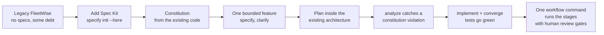
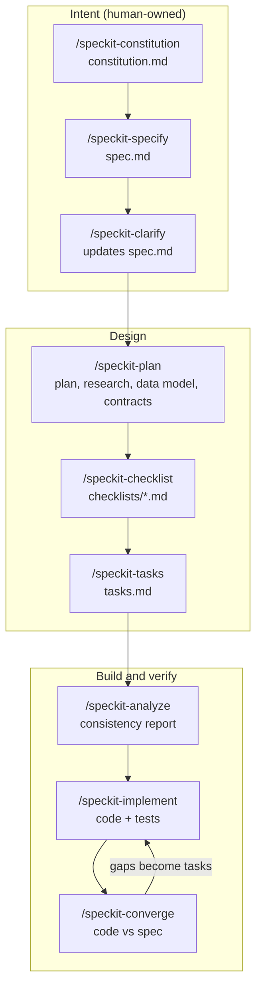
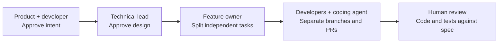
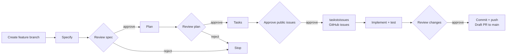
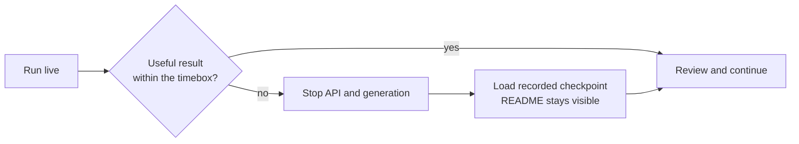
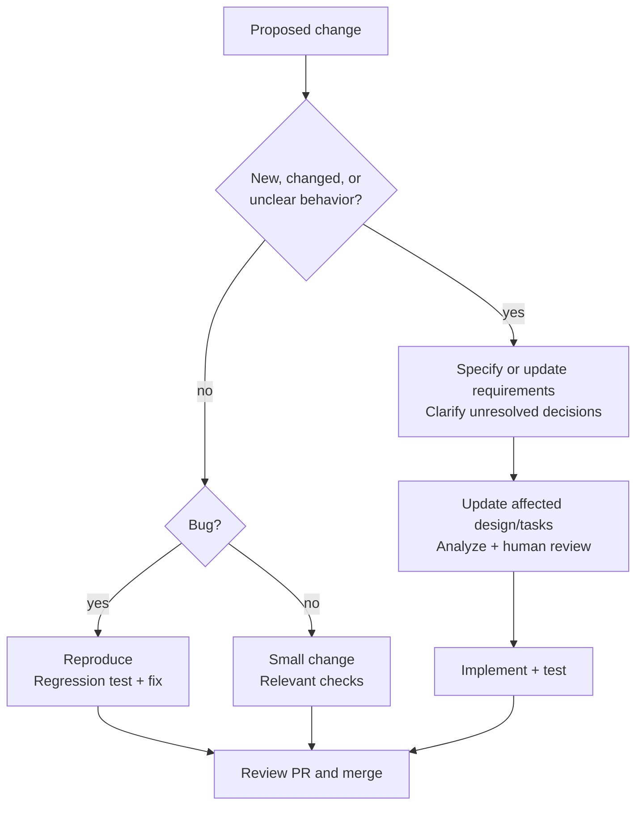
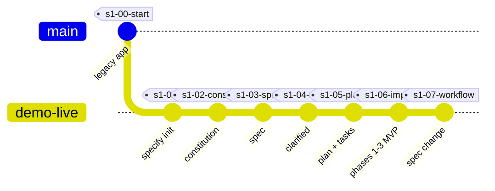

# Spec Kit on a Brownfield App: FleetWise

**Stop prompting, start specifying.** A hands-on, repeatable demo of spec-driven development (SDD) with [GitHub Spec Kit](https://github.com/github/spec-kit) and GitHub Copilot, applied to an existing ("brownfield") .NET application.

FleetWise is a fictional fleet-maintenance SaaS. It works, but like most real systems it has history: shortcuts, missing rules, and no specs. This repo shows how a team adopts Spec Kit on code like that, one bounded slice at a time, and then automates the flow with Spec Kit workflows.

[](https://github.com/hkaanturgut/spec-kit-fleetwise/actions/workflows/ci.yml)

**Present from this file:** [Run of show](#presentation-and-live-demo-runbook) |
[Setup](#presenter-setup) | [Live steps](#step-1-add-spec-kit-16-17) |
[Team](#team-moment-32-37) | [Automation](#workflow-automation-37-42) |
[Q&A](#qa-everyday-development) | [Recovery](#checkpoint-recovery)

## What you will see



## Quick start

## The ideas behind this demo

### What is spec-driven development?

Spec-driven development (SDD) is a way to build software from an explicit,
reviewable description of intended behavior. The team agrees on the problem,
users, constraints, acceptance criteria, and important decisions before asking
someone or something to implement them. The specification is a living contract:
when the intent changes, the design, tasks, tests, and code that depend on it
can be updated together.

SDD does not mean writing a large document before writing any code. It means
making the next meaningful change understandable and testable. In a brownfield
system, start with one bounded slice, inspect the existing conventions, record
the decisions that matter, and leave the rest of the legacy system alone.

### SDLC vs. AI-DLC

The software development life cycle (SDLC) describes the stages a team uses to
deliver and operate software: discover requirements, design, build, test,
release, and learn from production. It is a useful map for the whole product
lifecycle and applies whether the work is manual or AI-assisted.

AI-DLC describes how those stages change when AI can generate designs, code,
tests, and documentation at high speed. The bottleneck moves from producing
artifacts to establishing intent, supplying context, checking correctness, and
approving risk. AI-DLC therefore emphasizes explicit specifications, small
reviewable increments, traceability, and human gates at decisions that affect
users, security, data, or architecture.

SDD is the practical bridge between them. It gives AI-DLC a stable source of
truth while preserving the familiar SDLC stages:

| SDLC concern | AI-DLC practice | Spec Kit evidence |
| --- | --- | --- |
| Requirements | Make intent and constraints explicit | Constitution, spec, clarification decisions |
| Design | Ask AI to work inside the existing architecture | Plan, data model, contracts, tasks |
| Construction | Generate bounded changes from approved tasks | Implementation, tests, code review |
| Verification | Check artifacts and behavior continuously | Analysis findings, test results, convergence report |
| Change management | Revisit only the stages affected by a requirement change | Updated artifacts and workflow state |

### Why practice SDD in the AI era?

AI makes implementation cheaper, but it does not make ambiguous requirements
safe. Without a shared specification, an agent can produce a polished answer
that silently invents a threshold, omits tenant isolation, or changes an API
contract. Faster generation can make incorrect assumptions spread faster too.

SDD helps a team:

- keep humans responsible for intent, trade-offs, and acceptance;
- give AI the context and constraints needed for useful implementation;
- review decisions before they are buried in code;
- trace a requirement through design, tasks, tests, and behavior;
- recover when an agent makes a plausible but incorrect change; and
- automate repeatable work without automating approval of unknown decisions.

The goal is not more paperwork. The goal is to move important reasoning into a
small, shared artifact that both people and AI can inspect.

### What is GitHub Spec Kit?

[GitHub Spec Kit](https://github.com/github/spec-kit) is an open-source toolkit
for practicing SDD with an AI coding agent. It provides reusable commands,
templates, and workflow support for turning intent into a constitution,
specification, clarification decisions, technical plan, tasks, implementation,
and verification.

Spec Kit is a delivery process, not a replacement application architecture or a
promise that AI-generated code is correct. Teams still choose the requirements,
review the design, run the tests, and approve the change. In this repository,
Spec Kit is applied to an existing .NET API: the team first captures current
conventions, then adds one tenant-scoped overdue-dispatcher slice without
rewriting FleetWise.

The central loop is:

```text
intent -> specify -> clarify -> plan -> tasks -> analyze -> implement -> converge
```

Each step leaves evidence that can be reviewed or rerun. That is what makes the
approach useful for both a human team and an AI-assisted workflow.

Prerequisites: .NET 8 SDK **8.0.400 or later in the 8.0 line** (see `global.json`), Python 3.11+, [uv](https://docs.astral.sh/uv/), Git, VS Code with GitHub Copilot. The workflow segment also needs [GitHub Copilot CLI](https://docs.github.com/copilot/how-tos/set-up/install-copilot-cli). The API examples use `curl` and `jq`; the team segment uses the GitHub CLI.

```bash
git clone https://github.com/hkaanturgut/spec-kit-fleetwise.git
cd spec-kit-fleetwise
scripts/install-tools.sh     # installs the pinned Spec Kit version (.speckit-version)
scripts/reset.sh             # branch demo-live at the starting checkpoint
scripts/preflight.sh         # green/red readiness check
dotnet run --project src/FleetWise.Api --urls http://localhost:5081
```

Swagger is at `http://localhost:5081/swagger`. For the full development demo, stop
the API with **Ctrl+C** and follow the [runbook below](#presentation-and-live-demo-runbook).
Port 5081 leaves any prepared reference instance on 5080 alone.

Check `dotnet --version` **inside this repository** before rehearsal. An older
8.0 SDK or a .NET 9 SDK installed elsewhere does not satisfy `global.json`.
If SDK resolution fails, check `which dotnet` and `dotnet --list-sdks`; select the
compatible installation on your PATH rather than weakening the repository pin.
`reset.sh` and `jump.sh` discard local files: save any work first.

## The spec-driven flow

Each step leaves a reviewable file. Humans own the intent; the AI does the translation; humans review at each gate.



## Presentation and live demo runbook

**Session title:** Stop Prompting, Start Specifying: Ship AI-Built Software You Can Trust with GitHub Spec Kit

**Story:** FleetWise is an existing fleet-maintenance SaaS. Its overdue report
uses a hard-coded mileage rule and mixes customers' data. We specify one change:
an overdue-maintenance dispatcher with technician suggestions and manager approval.
The live build implements **only User Story 1, the tenant-scoped overdue list**.
Suggestions and approval remain planned work, not finished demo endpoints.

| Minutes | Segment | Audience takeaway |
| --- | --- | --- |
| 0-3 | [Hook](#hook-prompt-only-coding-0-3) | A plausible answer can hide business assumptions |
| 3-16 | [Framing](#framing-why-specifications-3-16) | Agree on intent before generating code |
| 16-32 | [Steps 1-7](#step-1-add-spec-kit-16-17) | Adopt SDD on one slice of a real codebase |
| 32-37 | [Team moment](#team-moment-32-37) | Shared intent, parallel tasks, reviewed PRs |
| 37-42 | [Workflow automation](#workflow-automation-37-42) | Automate execution between human decisions |
| 42-45 | [First 30 days](#first-30-days-42-45) | Start small and measure the outcome |

### Presenter setup

Keep everything in **one VS Code window**:

- Open this `README.md` and use **Markdown: Open Preview to the Side**. Pin the preview.
- Keep **Copilot Chat in agent mode** beside it. `text` blocks below go into Copilot Chat.
- Use integrated **Terminal A** for `bash` blocks. Reserve **Terminal B** for the API.
- Set a readable font size, disable notifications, and confirm Mermaid diagrams render in your Markdown preview.

Use a dedicated practice clone. **Reset and jump discard uncommitted work and
local files.** Stop Terminal B's API before using either command.

**Terminal A, before the session:**

```bash
git status --short
scripts/reset.sh
scripts/preflight.sh
scripts/jump.sh --list
```

**Expected:** preflight GREEN, 15 baseline tests, eight checkpoint tags.
The helpers restore the current README, reset/jump/preflight scripts, and workflow
definition from local `main` after each checkout. Application code and specs still
come from the tag. These presentation/tooling differences can appear in `git status`;
that is intentional. Historical tags are never moved.

Start from an up-to-date `main` when preparing the practice clone. If you manually
checked out an old tag and are using its old helper scripts, bootstrap them once:

```bash
git restore --source=main -- README.md scripts/jump.sh scripts/reset.sh scripts/preflight.sh workflows/sdd-autopilot/workflow.yml
```

**Readiness limits:** the recorded checkpoints are available, but backup video
clips and the coding-agent PR segment still need preparation. The workflow segment
demonstrates starting the pipeline and reviewing its gates, not finishing an
AI-generated feature within five minutes.

### Hook: prompt-only coding (0-3)

**Say:** "A useful-looking endpoint can still implement the wrong business rules."

**Copilot Chat:**

```text
Add an endpoint that lists overdue vehicles and suggests a work order for each.
```

**Show:** one actual assumption in the response, such as an invented threshold,
missing tenant scope, or an unsupported technician choice. Do not claim a flaw
that the response does not contain. Stop a slow generation rather than wait.

**Terminal A, discard the hook and return to the baseline:**

```bash
scripts/jump.sh s1-00-start
```

**Fallback:** explain the known legacy rule, "10,000 km since any service," and
the missing tenant isolation. This is the baseline's recorded behavior, not a claim
about what Copilot just generated.

### Framing: why specifications? (3-16)

**Say:** "The specification is the blueprint. Code is an implementation of it,
not the place where we quietly invent the requirements."

- **Power inversion:** humans approve intent and constraints; AI translates them into design and code.
- **Why now:** faster code generation also produces incorrect assumptions faster.
- **Brownfield playbook:** inspect conventions, agree on rules, choose one slice, specify its behavior, implement inside the existing architecture.
- **Anti-pattern:** attempting to specify the entire legacy system before delivering any change.

| AI-DLC concern | Spec Kit activity | Reviewable evidence |
| --- | --- | --- |
| Intent and requirements | constitution, specify, clarify | Principles, spec, explicit decisions |
| Design | plan, tasks, analyze | Design artifacts, task dependencies, findings |
| Construction and verification | implement, converge | Code, tests, remaining gaps |
| Change management | Update affected artifacts and rerun stale stages | Traceable requirement-to-code changes |

**Agent, skill, workflow:** an agent is the worker; a skill is a reusable procedure;
a workflow coordinates execution and gates. This demo uses Copilot with Spec Kit
skills, not a separate custom agent for each stage.

**Navigate in this README:** the [spec-driven flow](#the-spec-driven-flow) is the
visual overview. The [Q&A](#qa-everyday-development) explains small changes,
bug fixes, and team adoption.

### Step 1: add Spec Kit (16-17)

**Terminal A:**

```bash
git switch -c "adopt-spec-kit-$(date +%Y%m%d-%H%M%S)"
```

> [!NOTE]
> **What:** `specify init` installs Spec Kit's project files and Copilot skills in this repository.<br>
> **When:** Once when adopting Spec Kit, before writing the constitution or a feature spec.<br>
> **Why:** Give the agent a repeatable process without replacing the existing application. `--force` permits setup in a non-empty directory; review the resulting changes.

```bash
specify init --here --force --integration copilot
git status --short
```

**Say:** "We added the delivery process, not a new application architecture."

**Expected:** `.specify/` and `.github/skills/` contain the generated process files;
application code is unchanged. Use hyphenated skills such as `/speckit-plan`.

**Checkpoint / recovery:**

```bash
scripts/jump.sh s1-01-init
```

### Step 2: derive the constitution (17-20)

**Copilot Chat, discovery only:**

```text
Read this repository and list the engineering conventions it already follows: layering, data access, validation, error handling, testing, naming, configuration, and multi-tenancy. For each convention, cite one or two files as evidence. Then list every place that breaks the convention. Do not change any files.
```

**Expected evidence:** VehiclesController and WorkOrdersController use services;
TechniciansController and ReportsController access DbContext directly. TenantId
exists in the data model, but legacy queries do not enforce isolation.

**Say:** "Existing code is evidence, not automatically policy. We keep the service
layer, record its violations as debt, and explicitly agree on tenant isolation."

**Copilot Chat:**

> [!NOTE]
> **What:** `/speckit-constitution` records the team's agreed engineering principles.<br>
> **When:** At adoption, or when the team deliberately changes its rules, not for every ticket.<br>
> **Why:** Make constraints such as tenant isolation explicit so later design and implementation can be reviewed against them.

```text
/speckit-constitution Capture only principles that are true in this codebase today or that the team agreed now:
1. Data access goes through the service layer; controllers never use DbContext directly. The two existing violations are known debt, not allowed patterns.
2. Tenant isolation is mandatory: every query and command is scoped by TenantId. This is a new rule agreed today.
3. Tests first: new behavior starts with failing xUnit tests.
4. The public REST API stays backward compatible; changes are additive.
5. No secrets in code; configuration comes from environment variables or appsettings.
```

**Show:** `.specify/memory/constitution.md`. Review the diff before committing.

```bash
git --no-pager diff --stat
git add -A
git commit -m "docs: adopt Spec Kit constitution"
```

**Checkpoint / recovery:**

```bash
scripts/jump.sh s1-02-constitution
```

### Step 3: specify one bounded slice (20-23)

**Copilot Chat:**

> [!NOTE]
> **What:** `/speckit-specify` turns a feature request into user stories, requirements, and acceptance criteria.<br>
> **When:** Starting a bounded feature or behavior change that needs an explicit agreement.<br>
> **Why:** Define what success means before the agent chooses how to implement it. A straightforward bug with clear expected behavior does not need a new feature spec.

```text
/speckit-specify Fleet managers need an overdue-maintenance dispatcher. Show vehicles that are overdue or due within 7 days, by mileage or by date. Suggest a work order for each vehicle with the right service type and a technician who has the required skill. A manager must approve a work order before it is booked.
```

If `specify` asks its own questions, reply:

```text
Keep them as open questions in the spec; we will run clarify next.
```

**Show:** the generated `specs/<feature>/spec.md`: user stories, acceptance
criteria, requirements, and clarification markers. A live run can choose a
different folder name; the checkpoints use `specs/001-overdue-dispatcher/`.

**Say:** "We specify the change, not the whole system."

**Checkpoint / recovery:**

```bash
scripts/jump.sh s1-03-specify
```

### Step 4: clarify business decisions (23-25)

**Copilot Chat:**

> [!NOTE]
> **What:** `/speckit-clarify` asks targeted questions and integrates the answers into the spec.<br>
> **When:** Requirements contain ambiguities or unresolved business decisions, ideally before planning.<br>
> **Why:** Have people decide policy rather than letting implementation silently invent it.

```text
/speckit-clarify
```

**Prepared answers:**

- No qualified technician: suggest unassigned, flag "no qualified technician," and never use another customer's technician.
- Approval: only a FleetManager in the same customer.
- Several qualified technicians: fewest scheduled work orders in the next seven days; ties alphabetically.

**Show:** the decisions integrated into the spec and unresolved markers removed.

**Checkpoint / recovery:**

```bash
scripts/jump.sh s1-04-clarify
```

### Step 5: plan within the existing architecture (25-27)

**Copilot Chat, one command at a time:**

> [!NOTE]
> **What:** `/speckit-plan` translates the spec into a technical plan and supporting design artifacts.<br>
> **When:** Behavior is understood, before generating implementation tasks; revisit it when requirements or design constraints change.<br>
> **Why:** Check architecture, data contracts, and constitution compliance before investing in code.

```text
/speckit-plan Extend the existing .NET 8 Web API and EF Core model. Reuse VehicleService and WorkOrderService, add a DispatcherService in the existing service layer, and expose endpoints under /api/dispatch. Use the existing SQLite setup locally. No new projects and no new frameworks.
```

> [!NOTE]
> **What:** `/speckit-tasks` converts the spec and design into an ordered implementation checklist.<br>
> **When:** The plan is ready for review, or design changes require the task list to be reconciled.<br>
> **Why:** Make dependencies, test work, and potential parallel tasks visible instead of asking the agent to build everything at once.

```text
/speckit-tasks
```

**Show:** `plan.md`, `data-model.md`, `contracts/`, and `tasks.md`.

**Always load the prepared fault for the next teaching moment:**

```bash
scripts/jump.sh s1-05-plan-tasks
```

**Say:** "This checkpoint deliberately contains a bad technician lookup. We are
testing whether analysis catches it, not claiming every live plan makes this mistake."

The lookup `TechnicianMatcher.SuggestAsync(serviceType, requiredSkill)` is not
tenant-scoped, while the plan's Constitution Check says PASS.

### Step 6: analyze catches the gap (27-28)

**Copilot Chat:**

> [!NOTE]
> **What:** `/speckit-analyze` checks the spec, plan, and tasks for inconsistencies, coverage gaps, and constitution violations without fixing them.<br>
> **When:** All three artifacts exist, before implementation and after significant artifact changes.<br>
> **Why:** Find contradictions cheaply while they are still in the design. This is not a substitute for tests or human review.

```text
/speckit-analyze
```

**Expected findings to point at:**

| Finding | Severity | Why it matters |
| --- | --- | --- |
| Technician lookup lacks TenantId; plan incorrectly says PASS | CRITICAL | Violates the tenant-isolation principle |
| No test proves another tenant's technician is excluded | HIGH | The safety requirement is not covered |

**Copilot Chat, fix the source rather than suppressing the finding:**

```text
Fix this at the source: update plan.md and data-model.md so every dispatcher query and command is scoped by TenantId. Do not edit tasks.md by hand.
```

> [!NOTE]
> **What:** Rerun `/speckit-tasks` to reconcile the checklist with the corrected tenant-scoped design.<br>
> **When:** After fixing the source artifacts identified by analysis.<br>
> **Why:** Carry the design correction into implementation and test tasks, rather than leaving a stale checklist.

```text
/speckit-tasks
```

> [!NOTE]
> **What:** Rerun `/speckit-analyze` against the updated artifacts.<br>
> **When:** After regenerating tasks and before moving into implementation.<br>
> **Why:** Verify that the original finding is resolved and the correction did not introduce another inconsistency.

```text
/speckit-analyze
```

**Expected:** the critical tenant-scope finding is resolved. Other findings still
need review; a PASS label alone is not evidence.

**Fallback:** show the recorded correction in Terminal A:

```bash
git --no-pager diff s1-05-plan-tasks s1-06-implement -- specs/001-overdue-dispatcher/plan.md specs/001-overdue-dispatcher/data-model.md specs/001-overdue-dispatcher/tasks.md
```

The fault is recorded at `s1-05-plan-tasks`; the corrected design and built MVP
are in `s1-06-implement`. There is no separate post-analysis tag. If time is short,
use the Step 7 recovery rather than imply the recorded implementation just ran live.

### Step 7: implement and converge (28-32)

**Copilot Chat:**

> [!NOTE]
> **What:** `/speckit-implement` executes the planned tasks, modifying code and tests.<br>
> **When:** The design is reviewed and critical analysis findings are resolved.<br>
> **Why:** Build against explicit scope and dependencies. Here the phase limit keeps the live build to User Story 1, not the entire feature.

```text
/speckit-implement Phases 1 to 3 only (User Story 1, the MVP)
```

**Terminal A:**

```bash
dotnet test --nologo
```

**Copilot Chat:**

> [!NOTE]
> **What:** `/speckit-converge` compares the implementation with the feature artifacts and records remaining gaps as tasks.<br>
> **When:** After an implementation slice and its tests, or when checking whether code has caught up with the spec.<br>
> **Why:** Passing tests alone do not prove requirement coverage. Convergence exposes unfinished behavior without pretending the feature is complete.

```text
/speckit-converge
```

**Expected at the checkpoint:** 24 passing tests, up from 15. Converge records
T026: an unknown tenant returns `200` with an empty list rather than the contract's
`400`. Suggestions and approvals remain open tasks. Live test counts can vary;
review behavior instead of manufacturing the reference output.

**Checkpoint / recovery, with the API stopped:**

```bash
scripts/jump.sh s1-06-implement
dotnet test --nologo
```

**Terminal B:** start or restart the API from this same practice clone. A fresh
demo database keeps the seeded dates current without deleting another database.

```bash
ConnectionStrings__FleetWise="Data Source=fleetwise-$(date +%Y%m%d-%H%M%S).db" \
  dotnet run --project src/FleetWise.Api --urls http://localhost:5081
```

**Terminal A, the punchline without opening a browser:**

```bash
curl -fsS http://localhost:5081/api/reports/overdue | jq .count
# 4 vehicles across tenants, using the old rule

curl -fsS http://localhost:5081/api/dispatch -H "X-Tenant-Id: 1" \
  | jq '{lines: .count, vehicles: ([.lines[].vehicleId] | unique | length)}'
# 38 lines, 24 vehicles, tenant 1 only

curl -fsS http://localhost:5081/api/dispatch -H "X-Tenant-Id: 2" \
  | jq '[.lines[].vehicleId] | unique | length'
# 15 vehicles, tenant 2 only
```

**Say:** "The feature follows the agreed schedules and tenant boundary. More
results are not the lesson; explicit rules and verifiable behavior are."

### Team moment (32-37)

**Say:** "The spec is the contract between people, not just between a person and AI."



Use the [team Q&A](#how-do-multiple-team-members-work-on-the-same-project) below
without leaving the README. Three gates are intent, design, and implementation.
`[P]` is a candidate for parallel work, not proof that tasks cannot conflict.

**Prepare before presenting, not during the five-minute segment:**

> [!NOTE]
> **What:** `/speckit-taskstoissues` turns feature tasks into GitHub issues.<br>
> **When:** The task breakdown is reviewed and you are ready to distribute work.<br>
> **Why:** Move agreed work into the team's tracking and PR process. This creates remote issues; it does not by itself assign agents or guarantee independent tasks.

```text
/speckit-taskstoissues
```

That command creates GitHub issues. Review them, label demo issues `demo`, and
assign two genuinely independent tasks to the Copilot coding agent if the account
has access. Prepare the resulting PRs before the session.

**Terminal A, show prepared work without changing windows:**

```bash
gh issue list --label demo --state open
gh pr list --label demo --state open
```

If no PRs are ready, use the diagram and explain the operating model. Do not
present an empty list as a completed coding-agent demonstration.

### Workflow automation (37-42)

**Say:** "We just ran the stages by hand. Now one command runs them for us.
We still own the decisions, but we do not have to type every slash command."

Use **`speckit-delivery`**, this repo's small extension of the built-in `speckit`
sequence. It adds GitHub task issues, a test check, and a draft PR to `main`.
You still start the entire pipeline with one command.



**Prepare once before this segment, in an integrated terminal.** Start a separate
working directory from current `origin/main`, keeping its existing initialization.
If it is not initialized, load the setup and agreed constitution from the checkpoint.
This avoids publishing historical
README/application regressions. Your earlier demo work stays untouched:

```bash
WORKFLOW_DEMO="$(mktemp -d "${TMPDIR:-/tmp}/fleetwise-workflow.XXXXXX")"
git fetch origin main
git worktree add --detach "$WORKFLOW_DEMO" origin/main
cd "$WORKFLOW_DEMO"
if [[ ! -f .specify/integration.json ]]; then
  git restore --source=s1-02-constitution -- .github/skills .specify
fi
```

GitHub CLI must have the `hkaanturgut` account signed in with repository write
access. The workflow switches to and verifies that account, and checks both
origin URLs before creating a unique `demo/delivery-*` branch.
This demo's publication helper deliberately allows only this repository.

**Run the pipeline, not the individual slash commands:**

> [!NOTE]
> **What:** This workflow runs specify, plan, tasks, taskstoissues, implement, tests, and GitHub publication.<br>
> **When:** The dedicated worktree and constitution are ready, and you want a tracked feature delivered as a PR.<br>
> **Why:** Automate the handoffs as well as coding, with approval before public issues and publication.

```bash
specify workflow run ./workflows/speckit-delivery/workflow.yml \
  -i integration=copilot \
  -i spec="Extend the existing GET /health endpoint to return the fixed service name FleetWise.Api alongside the existing status value ok. Preserve HTTP 200, the existing status field, and anonymous access. Add automated regression coverage. Keep all other endpoints, the database, dependencies, and architecture unchanged."
```

This intentionally tiny change keeps attention on orchestration. Normally a
change this small can use a normal PR; it does not require the full SDD cycle.

**What to show, not a specific generated result:**

1. The terminal starts the **specify** stage without a slash command.
2. At **Review spec**, open the generated `spec.md` from the feature path printed
   in the terminal. Review it, then choose **approve** to let planning run.
3. At **Review plan**, approve the design. The workflow generates **tasks**.
4. Review `tasks.md`, then approve **public issue creation**. `taskstoissues`
   creates one `demo`-labeled GitHub issue per task and records `issue-links.json`.
   Implementation and tests run automatically next.
5. Review the diff and new files, then approve **publication**. The workflow
   commits to its feature branch, pushes it, and prints a **draft PR to `main`**.
   The PR links the task issues with `Closes #...`; they close on merge, not on
   code generation. Nothing merges automatically.

Choose **reject** if the scope or design is wrong. Leave terminal input connected:
do **not** add `< /dev/null` to this interactive demonstration.
The point is the pipeline and its gates, not identical generated files or a
finished feature during the five-minute segment. If generation is slow, explain
the diagram and let the run continue; finish the reviews during rehearsal.

**Say:** "The workflow coordinates the work. Copilot executes each stage.
People approve intent and design, then review the resulting code before merging."

The original built-in `speckit` workflow still stops after implementation.
Our [delivery definition](workflows/speckit-delivery/workflow.yml) adds these
GitHub stages without modifying the installed built-in. It does not add clarify,
analyze, or converge; the [advanced example](docs/workflow-automation.md) covers
those customizations. A completed pipeline is not proof that code is correct.
Copilot has broad tool permissions by default; a worktree protects against
accidental file overlap, **not** against unrestricted tool access.

<details>
<summary>Recovery only: inspect or resume a paused run</summary>

Run these in the same workflow working directory.

> [!NOTE]
> **What:** `specify workflow status` shows saved runs and their current stage.<br>
> **When:** A run has paused or failed.<br>
> **Why:** Find its run ID and distinguish an approval pause from an error.

```bash
specify workflow status
```

> [!NOTE]
> **What:** `specify workflow resume` continues the saved run and prompts at its review gate.<br>
> **When:** Resuming a paused run, or retrying after diagnosing and fixing a failure.<br>
> **Why:** Continue without restarting completed stages. Replace `<run_id>` with the printed ID.

```bash
specify workflow resume <run_id>
```

Retries reuse issues for the same branch/feature/task, including closed issues,
and reuse an open PR for the same branch. A failed test or missing task issue
stops publication; failures are not silently treated as success. A new run in
a new worktree intentionally creates a new issue set.
If `main` changes during a long run, resolve any PR conflicts through the normal
branch-review process. The workflow does not overwrite `main` or force-resolve conflicts.

For a fresh attempt, repeat the preparation block **from the original demo
checkout**; keep the previous run for inspection. Do not reset your earlier live work.
Record this workflow segment during rehearsal using the
[backup checklist](demo/backups.md). The older `s1-07-workflow` result demonstrates
the state-aware workflow, not the issue/PR delivery pipeline.

</details>

### First 30 days (42-45)

- **Week 1:** pick one bounded change; agree on a small constitution and capture baseline tests.
- **Week 2:** use the spec/design/code review gates; measure review effort and rework.
- **Week 3:** divide independent tasks across people and agents; record integration conflicts and escaped defects.
- **Week 4:** automate repeatable stages with limits and logs; keep human approval at meaningful decisions.

**Close:** "Small fix: normal PR. Requirement change: relevant Spec Kit stages.
Approved implementation: bounded automation."

### Checkpoint recovery

For every live step, use its recovery command above if it is slow or goes
off-script. A useful live threshold is 90 seconds before switching to the prepared
result. Treat the checkpoint as a transparent fallback, not as newly generated work.



Checkpoint files are available now. Video clips still need recording: hook,
constitution, analyze finding, implementation/convergence, and workflow pipeline.
Never force-update the published `s1-*` tags during practice.

## Q&A: everyday development

### Do we need Spec Kit for every change, including small ones?

**No. Match the process to uncertainty and risk, not the size of the diff.**
Typos, formatting, and straightforward fixes can use a normal PR with relevant
checks. New behavior or unclear requirements benefit from specification.
A two-line authorization change can still need careful design review and tests.



This is a recommended team process, not a rule enforced by Spec Kit. Even
[Spec Kit's contribution guidance](https://github.com/github/spec-kit/blob/main/CONTRIBUTING.md)
allows small fixes through the normal issue, PR, review, and test process.

### How do we fix a bug without starting the whole lifecycle again?

**If the agreed behavior is clear, fix the implementation.** Reference the
requirement, add a failing regression test, fix the root cause, and review the PR.
Update the spec only if the intended behavior is missing, ambiguous, or changing.

FleetWise example: **T026** records that an unknown tenant gets `200` with an
empty list, although the dispatcher API contract requires `400`.

- Add a test expecting `400` for an unknown tenant.
- Fix tenant validation and run the relevant tests plus the existing suite.
- Close the task with the reviewed fix. No new constitution or feature spec is needed.

The bug is deliberately still present at `s1-06-implement` for this teaching moment.

### How do multiple team members work on the same project?

**Share the specification, divide the work, and review through PRs.**

| Responsibility | Owner |
| --- | --- |
| Intent and acceptance criteria | Product owner and developers |
| Design and constitution compliance | Technical lead |
| Bounded implementation tasks | Developers and coding agents |
| Integration and task-list reconciliation | Named feature owner |
| Shared tooling and workflow defaults | Platform or DevEx team |

For feature work, use one feature folder and an integration branch, with separate
task branches/worktrees for parallel contributors. Assign only truly independent
`[P]` tasks in parallel; shared files and dependencies still need coordination.
Avoid multiple agents rewriting the same `tasks.md` simultaneously.

Timestamp-based feature naming reduces numbering collisions. Each worktree must
select the right feature through `.specify/feature.json` or
`SPECIFY_FEATURE_DIRECTORY`. Separate spec folders do not eliminate conflicts
in shared application code.

Use CODEOWNERS and branch protection to enforce review. Spec Kit does not enforce
team ownership itself. See the [team playbook](docs/team-playbook.md) for the
three gates: intent, design, and implementation.

### What is the difference between custom agents, skills, and workflows?

**Agent = worker. Skill = procedure. Workflow = coordination.**

| Mechanism | Purpose | FleetWise example |
| --- | --- | --- |
| Custom agent | A named role with instructions and host-supported tool/model configuration | A reviewer configured with read-only tools |
| Skill | Reusable task instructions and supporting resources, loaded by the active agent | `/speckit-plan` |
| Workflow | Ordered steps, conditions, checks, and approval gates | `speckit-delivery` extends the built-in `speckit` sequence |

Spec Kit v1.0.13 defaults to `.github/skills/speckit-*/SKILL.md` for new Copilot
projects. The `.github/agents/*.agent.md` plus companion prompt layout is still
available through `--integration-options="--commands"`. These are alternative
layouts for Spec Kit's own steps; your team's custom agents can coexist with skills.
The intended artifacts are the same. Our tested demo stays in skills mode.

Neither a skill nor selecting a custom agent automatically guarantees a separate
context or security isolation. Tool restrictions must be configured, not merely
described in a role name.

### What are the most useful adoption practices?

- **Specify the change, not the entire legacy system.** Start with one bounded slice.
- **Keep the constitution small and deliberate.** Change team rules through review, not for every ticket.
- **Review actual artifacts.** An AI saying "done" or exiting successfully is not proof of correctness.
- **Keep spec and code consistent.** Update affected artifacts when requirements change; preserve completed task history.
- **Use tests as evidence.** Analyze checks artifact consistency; it does not replace execution or code review.
- **Pin tooling and keep recovery points.** Use small PRs and known-good checkpoints, not an unlimited autonomous run.

### How do we use Spec Kit workflows?

**Run a workflow instead of typing each slash command.** The
[live example above](#workflow-automation-37-42) uses `speckit-delivery`:
specify, plan, tasks, taskstoissues, implement, test, commit/push, draft PR.
It still calls Copilot and the Spec Kit procedures underneath.

| Start here | Customize later |
| --- | --- |
| Built-in `speckit`: specify through implementation, with two review gates | `speckit-delivery`: task issues and tested, reviewed publication to a draft PR |
| One workflow command, then approve or reject at the gates | `sdd-autopilot`: skip unchanged work, analyze, and optionally implement/test/converge |

You do not need a custom workflow for basic automation; GitHub publication is
our explicit extension. The optional
[advanced guide](docs/workflow-automation.md) covers our custom definition,
state checks, and its separate resume/approval inputs.

### Can it run automatically without someone watching every step?

**Yes. People review decisions; the workflow handles execution between them.**
You do not need to watch every tool call. Return at the spec, plan, public-issue,
and publication gates, then review the PR and CI before merging.

Running from a terminal is not the same as scheduled CI automation. This repo's
CI tests workflow wiring with a stub Copilot and mocked GitHub; CI does not launch
real unattended coding runs. Running `speckit-delivery` locally does create real
issues and a draft PR after the corresponding approvals. It does not create a
GitHub Projects board or automatically assign tasks to agents.

For unattended execution, use an isolated runner, narrowly scoped credentials,
time/cost limits, saved logs, and escalation on failure. Do not pre-approve unseen
plans simply to remove pauses. See the
[advanced guide](docs/workflow-automation.md) for the custom workflow's limits.

## Checkpoints

The tags record the major demo states. `scripts/jump.sh <tag>` restores the
application and specification state while keeping this README and maintained
demo tooling from local `main`. The post-analysis correction shares the
implementation checkpoint rather than having its own tag.



> The checkpoints were recorded in a full dry run with Spec Kit v1.0.13. Expected AI outputs for each step are in [demo/reference-outputs.md](demo/reference-outputs.md).

## Repository map

| Path | What it is |
| --- | --- |
| `src/FleetWise.Api` | The legacy .NET 8 Web API (EF Core + SQLite, Swagger) |
| `tests/FleetWise.Tests` | xUnit tests, including characterization tests of legacy behavior |
| `workflows/sdd-autopilot` | Spec Kit workflow: runs only the stale SDD steps, with human gates |
| `scripts/` | `install-tools`, `preflight`, `reset`, `jump`, and the `speckit_state.py` state checker |
| `tests/workflow` | Offline scenario tests for the workflow, using a stub Copilot CLI |
| `docs/` | Architecture, demo guide, team playbook, workflow automation |
| `demo/` | Feature cards and backup notes for live sessions |

## Documentation

- [Architecture and known debt](docs/architecture.md)
- [Presentation and demo runbook: every command and prompt](#presentation-and-live-demo-runbook)
- [Team playbook: Spec Kit with many developers](docs/team-playbook.md)
- [Workflow automation: the sdd-autopilot workflow](docs/workflow-automation.md)

## License

[MIT](LICENSE)
