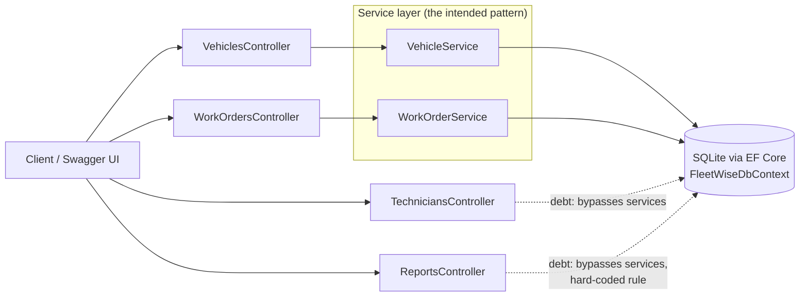
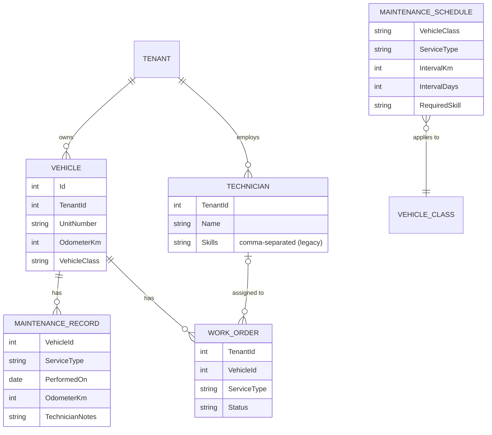
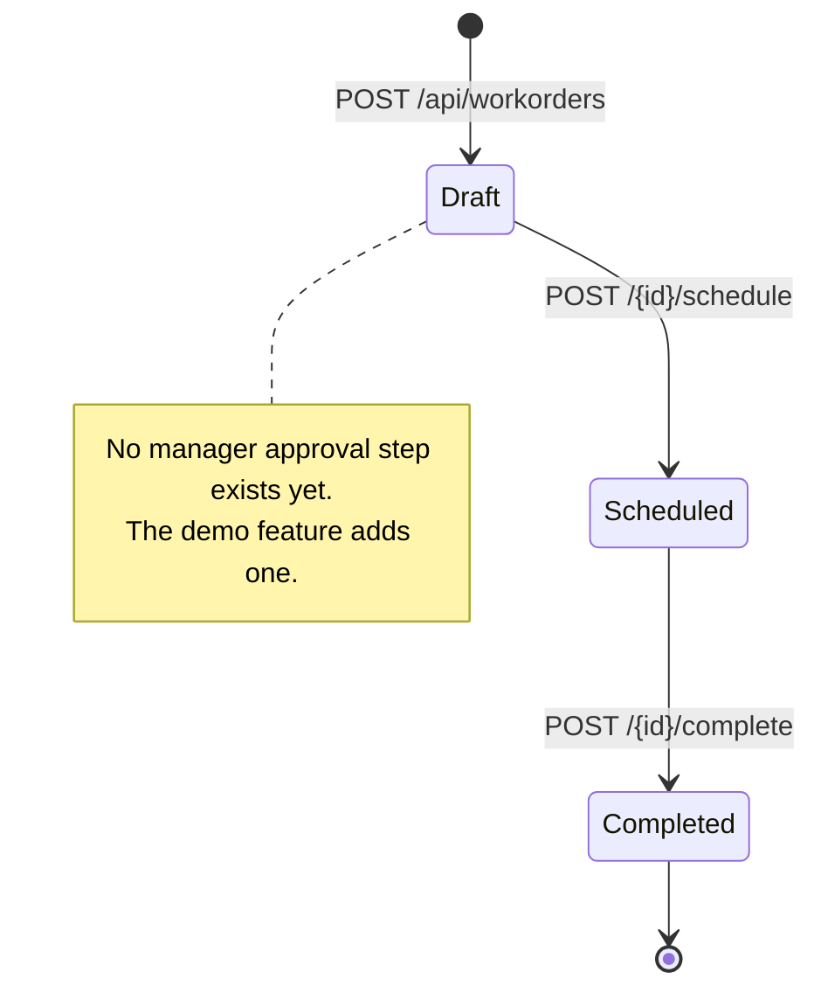

# FleetWise architecture and known debt

FleetWise is intentionally "legacy": it runs, it has tests, and it has the kind of shortcuts real systems collect over the years. The demo does not hide them. The constitution records them as known debt, and spec-driven changes fix them deliberately.

## Components

## Data model

## Work order lifecycle (today)

## Known debt (planted on purpose)

| Debt | Where | How the demo surfaces it |
| --- | --- | --- |
| No tenant isolation: every query returns all tenants | Every service and controller | Constitution adds a tenant-isolation rule; `/speckit-analyze` flags plans that forget it |
| Two controllers bypass the service layer | `TechniciansController`, `ReportsController` | Copilot's convention discovery lists them as violations; the team records them as debt |
| Hard-coded "overdue" rule (10,000 km since any service) that ignores maintenance schedules | `ReportsController.Overdue` | The dispatcher spec replaces it with schedule-based logic |
| Thin validation on work order creation | `WorkOrderService.CreateAsync` | Characterization test documents it; a spec changes it deliberately |
| Skills stored as a comma-separated string | `Technician.Skills` | Surfaces in plan and data-model discussions |
| Tenant 2 has no DOT inspector | Seed data | A realistic question for `/speckit-clarify` |
| One technician note contains a prompt injection | Seed data (`MaintenanceRecord` 17) | Reserved for the Microsoft Foundry session's red-team evaluation |

## Characterization tests

Tests prefixed `Characterization_` pin down current behavior, including behavior we do not want (for example, reading every tenant). They make brownfield change safe: when a spec changes that behavior on purpose, the test is updated in the same PR, and reviewers see it.
