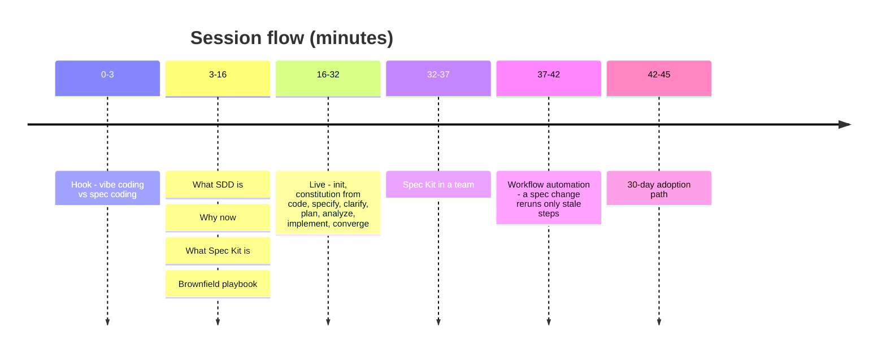
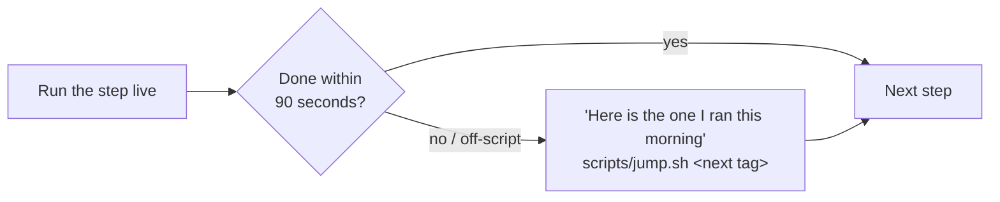

# Demo guide

A 45-minute session: concepts, a live brownfield adoption of Spec Kit, the team model, and workflow automation. Every command and prompt below is copy-paste ready.



## Before you start

```bash
scripts/reset.sh
scripts/preflight.sh
```

VS Code: Copilot Chat in **agent mode**, font zoom on, notifications off.

## Recovery rule



## Hook (0-3): vibe coding

```bash
git switch -c hook-vibe
```

```text
Add an endpoint that lists overdue vehicles and suggests a work order for each.
```

Point at one silent assumption (no tenant filter, invented thresholds), then `scripts/jump.sh s1-00-start`.

## Step 1 (16-17): add Spec Kit to the existing app

```bash
git switch -c adopt-spec-kit
specify init --here --force --integration copilot
git status
```

Only `.specify/` and `.github/skills/` are new. "Nothing in the application changed." Checkpoint: `s1-01-init`.

## Step 2 (17-20): constitution from the code

Discovery prompt (plain agent mode, not a Spec Kit command):

```text
Read this repository and list the engineering conventions it already follows: layering, data access, validation, error handling, testing, naming, configuration, and multi-tenancy. For each convention, cite one or two files as evidence. Then list every place that breaks the convention. Do not change any files.
```

Decide with the room: keep the service layer, record the two violations as known debt, add tenant isolation as a new rule.

```text
/speckit-constitution Capture only principles that are true in this codebase today or that the team agreed now:
1. Data access goes through the service layer; controllers never use DbContext directly. The two existing violations are known debt, not allowed patterns.
2. Tenant isolation is mandatory: every query and command is scoped by TenantId. This is a new rule agreed today.
3. Tests first: new behavior starts with failing xUnit tests.
4. The public REST API stays backward compatible; changes are additive.
5. No secrets in code; configuration comes from environment variables or appsettings.
```

```bash
git add -A && git commit -m "Adopt Spec Kit with constitution"
```

Checkpoint: `s1-02-constitution`.

## Step 3 (20-23): specify one bounded slice

```text
/speckit-specify Fleet managers need an overdue-maintenance dispatcher. Show vehicles that are overdue or due within 7 days, by mileage or by date. Suggest a work order for each vehicle with the right service type and a technician who has the required skill. A manager must approve a work order before it is booked.
```

"This describes only the change, not the whole legacy system." Checkpoint: `s1-03-specify`.

> Spec Kit v1.0.13's `specify` may ask up to 3 questions itself. Reply: "Keep them as open questions in the spec; we will run clarify next." That keeps the clarify moment for Step 4.

## Step 4 (23-25): clarify

```text
/speckit-clarify
```

Prepared answers:

- No technician with the skill: suggest the work order unassigned and flag it "no qualified technician"; never suggest another customer's technician.
- Who can approve: only users with the FleetManager role in the same customer.
- Several qualified technicians (clarify often asks this one itself): the one with the fewest scheduled work orders in the next 7 days; ties alphabetical.

Checkpoint: `s1-04-clarify`.

## Step 5 (25-27): plan inside the existing architecture

```text
/speckit-plan Extend the existing .NET 8 Web API and EF Core model. Reuse VehicleService and WorkOrderService, add a DispatcherService in the existing service layer, and expose endpoints under /api/dispatch. Use the existing SQLite setup locally. No new projects and no new frameworks.
```

```text
/speckit-tasks
```

Then always `scripts/jump.sh s1-05-plan-tasks`: in that checkpoint the plan's technician lookup (`TechnicianMatcher.SuggestAsync(serviceType, requiredSkill)`) is not scoped by tenant, while its Constitution Check still says PASS.

## Step 6 (27-28): analyze catches the gap

```text
/speckit-analyze
```

```text
Fix this at the source: update plan.md and data-model.md so every dispatcher query and command is scoped by TenantId. Do not edit tasks.md by hand.
```

Expected: one **CRITICAL** constitution finding (Principle II: technician lookup not tenant-scoped, and the plan wrongly marks it PASS) plus a HIGH coverage gap for FR-010. See [reference outputs](../demo/reference-outputs.md).

Then `/speckit-tasks` and `/speckit-analyze` again: no critical findings.

## Step 7 (28-32): implement and converge

```text
/speckit-implement Phases 1 to 3 only (User Story 1, the MVP)
```

```bash
dotnet test
```

```text
/speckit-converge
```

Expected: 9 new tests, 24 in total, all green. `/speckit-converge` appends one real gap as T026 (a non-existent tenant gets 200 instead of 400).

**Punchline to show live:**

```bash
curl -s localhost:5080/api/reports/overdue | jq .count                       # legacy rule: 4 vehicles, all tenants
curl -s localhost:5080/api/dispatch -H "X-Tenant-Id: 1" | jq '[.lines[].vehicleId] | unique | length'   # schedules: 24, tenant 1 only
```

Checkpoint: `s1-06-implement`.

## Team moment (32-37)

Show a PR opened by the Copilot coding agent from a task issue (created with `/speckit-taskstoissues`). See [team-playbook.md](team-playbook.md).

## Workflow automation (37-42)

```bash
specify workflow add --dev ./workflows/sdd-autopilot   # once, before the session
specify workflow list
```

Add one line to `spec.md`:

```text
The overdue window is configurable per tenant (default 7 days).
```

```bash
python3 scripts/speckit_state.py explain
specify workflow run sdd-autopilot -i until=analyze
```

Narrate: specify skipped, clarify skipped, plan ran, tasks ran, analyze ran, paused at the plan gate. Type `approve`.

```bash
git diff --stat
specify workflow status
```

Checkpoint: `s1-07-workflow`. See [workflow-automation.md](workflow-automation.md).
