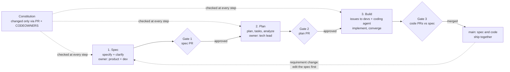
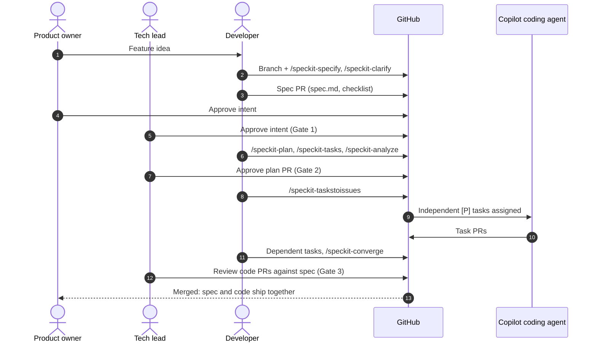
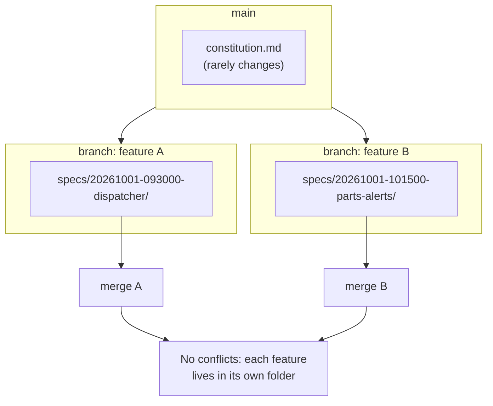

# Team playbook: Spec Kit with many developers

In a team, the spec is the contract between people, not just between one developer and an AI. This is a recommended operating model built on Spec Kit's mechanics; Spec Kit does not enforce it by itself.

**Golden rule:** one feature = one `specs/<feature>/` folder = one branch = reviewed through pull requests.

## Three review gates under one constitution



## Who owns what

| Role | Owns | Spec Kit steps |
| --- | --- | --- |
| Product owner / BA | The what and why | `specify`, `clarify`, reviews the requirements checklist |
| Tech lead / architect | The how, plus the rules | Constitution owner (CODEOWNERS), `plan`, `analyze` gate |
| Developers | Delivery | `tasks`, `implement`, `converge`, code PRs |
| Copilot coding agent | Parallel, well-scoped tasks | Picks up task issues, opens PRs for human review |
| Platform / DevEx | Consistency across repos | Pinned Spec Kit version, shared presets, shared workflows, baseline constitution |

## One feature through the team



## Parallel work without collisions



## Pitfalls and fixes

| Pitfall | Fix |
| --- | --- |
| Two developers create `003-...` on separate branches | Switch the git extension to `branch_numbering: timestamp` (YYYYMMDD-HHMMSS prefixes), or prefix names with the issue number |
| The "active feature" is wrong after switching branches | Spec Kit tracks it in `.specify/feature.json`, which is gitignored per machine. Point it at your feature, or set `SPECIFY_FEATURE_DIRECTORY` |
| Spec and code drift apart | Team rule: a requirement change starts with a spec edit PR, never a code-only PR |
| Constitution edited casually | Protect `.specify/memory/constitution.md` with CODEOWNERS |
| Each repo invents its own process | The platform team ships a shared preset, a shared workflow, and a baseline constitution; teams add only local rules (workflow overlays) |

Example `CODEOWNERS`:

```text
/.specify/memory/constitution.md   @your-org/tech-leads
/workflows/                        @your-org/platform
```
