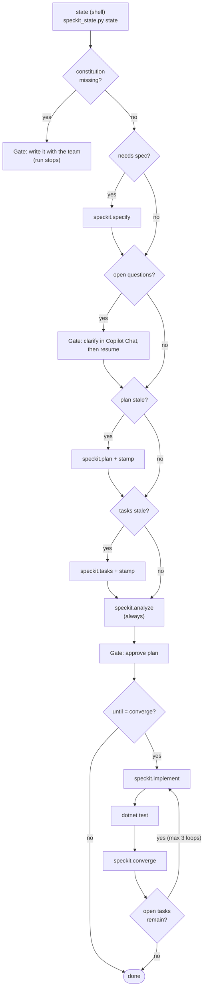
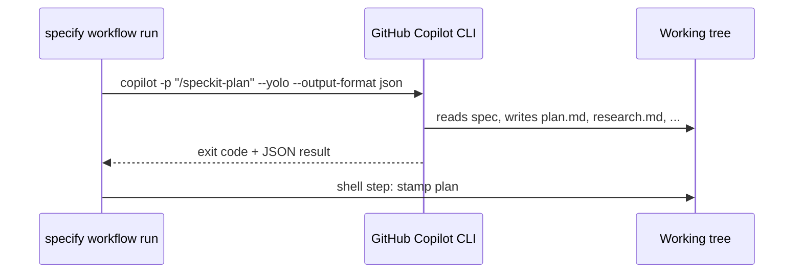

# Workflow automation: `sdd-autopilot`

[Spec Kit workflows](https://github.github.io/spec-kit/reference/workflows.html) are Spec Kit's pipeline engine: YAML that chains Spec Kit commands, shell steps, conditions, loops, and human gates. `sdd-autopilot` is a workflow that checks the repo first and runs only the SDD steps that are missing or stale.

## How it decides



## State checks

`scripts/speckit_state.py state` prints JSON the workflow branches on. Every flag is positive (`true` means "run this step"), and the script always exits 0, because a non-zero shell exit fails a workflow run.

| Flag | True when |
| --- | --- |
| `constitution_missing` | `.specify/memory/constitution.md` is missing or still has template placeholders |
| `needs_spec` | The active feature has no `spec.md` |
| `open_questions` | `spec.md` contains `[NEEDS CLARIFICATION` |
| `plan_stale` | No `plan.md`, or `spec.md` changed since the plan was built |
| `tasks_stale` | Plan is stale, no `tasks.md`, or `plan.md` changed since the tasks were built |
| `open_tasks` | `tasks.md` still has unchecked items |

**Fingerprints, not just timestamps.** After the workflow runs `plan` or `tasks`, it stamps a SHA-256 of the input (`spec.md` or `plan.md`) into `<feature>/.sdd-stamps.json`. A regenerated plan that comes out identical still counts as up to date. Without a stamp (a plan made by hand in chat), the script falls back to git commit time or file modification time.

Try it by hand:

```bash
python3 scripts/speckit_state.py explain
```

## Run it

```bash
specify workflow add --dev ./workflows/sdd-autopilot
specify workflow run sdd-autopilot -i until=analyze            # stop after the plan gate
specify workflow run sdd-autopilot -i until=converge           # build until converged
specify workflow run sdd-autopilot -i approval=approve         # pre-answer the plan gate (CI)
specify workflow status
specify workflow resume <run_id>                               # continue a paused run
```

Run history lives in `.specify/workflows/runs/<run_id>/` (`state.json`, `inputs.json`, `log.jsonl`).

## How a command step reaches Copilot



Each command step is a fresh, non-interactive Copilot session with a clean context, which keeps every step focused.

## Safety

- **Copilot runs with `--yolo` (all tools allowed) by default** in workflow runs. It is controlled by `SPECKIT_COPILOT_ALLOW_ALL_TOOLS`. Run workflows on a feature branch or in a sandbox, never on `main`.
- **`shell` steps have no sandbox,** and values are inserted as plain text. This workflow keeps free-text inputs out of `run` fields and restricts the others with `enum`.
- **Review any workflow you did not write** before running it.

## Team scale: overlays

The platform team owns the workflow. A team adds its own rule without forking:

```yaml
# .specify/workflows/overlays/sdd-autopilot/security.yml
id: "security-scan"
extends: "sdd-autopilot"
edits:
  - insert_after: analyze
    step: { id: secscan, type: shell, run: "dotnet list package --vulnerable" }
```

## Tested offline

`tests/workflow/run-scenarios.sh` runs the workflow against a throwaway copy of this repo with a stub Copilot CLI and asserts which steps ran:

| Scenario | Expected Spec Kit calls | Status |
| --- | --- | --- |
| A: template constitution | none | paused at the constitution gate |
| B: empty feature, `until=converge` | specify, plan, tasks, analyze, implement, converge | completed |
| C: `spec.md` changed | plan, tasks, analyze | completed |
| D: nothing changed | analyze | completed |
| E: `[NEEDS CLARIFICATION]` in spec | none | paused at the clarify gate |
